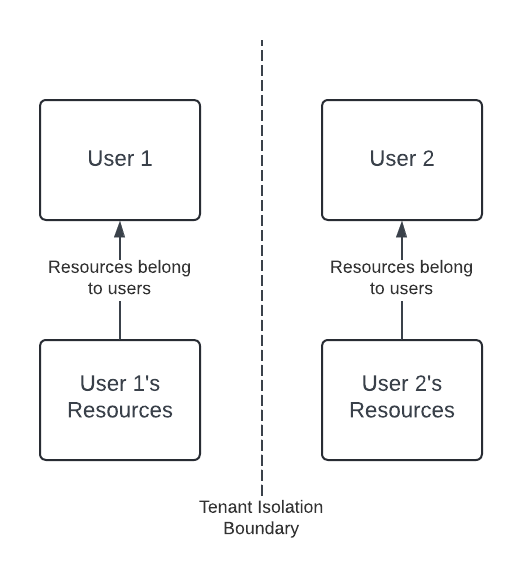
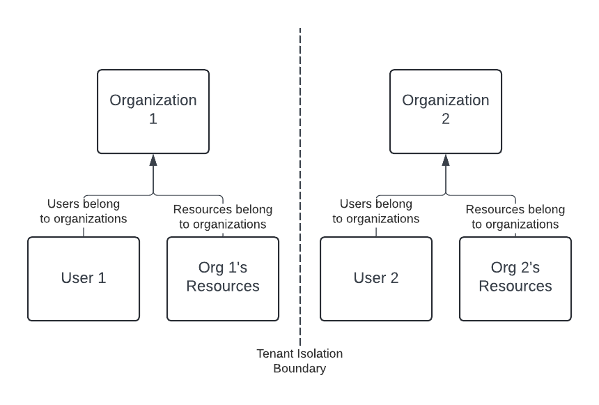

Tesseral is auth infrastructure specifically for B2B SaaS. That means it has B2B
multitenancy built-in. This article explains what multitenancy is, and how B2B
multitenancy works differently from B2C multitenancy.

## What is multitenancy?

In the context of software-as-a-service (SaaS), customers are also called
"tenants". "Multitenancy" means that one application serves many customers,
instead of having a separate deployment of your application for each customer.

When you implement multitenancy, you need *tenant isolation*. That refers to the
idea that one tenant can't see another tenant's data.

There are two kinds of SaaS products, and they each have their own tenancy
model: Business-to-Consumer (B2C) and Business-to-Business (B2B).

### B2C multitenancy

<Frame caption="A typical B2C data model. Most resources belong to users, and users can't see each others' resources.">
  
</Frame>

In B2C, you sell your software to *individuals*. E-commerce (Amazon, Walmart),
entertainment (Netflix, Spotify), and personal development (Strava, Duolingo)
products are mostly B2C.

B2C tenant isolation is around *users*. A user can see their own data, but they
can never see other users' data. To make that work, most data in a B2C product
exclusively belongs to a particular user (e.g. it has a `user_id` property in
the database).

### B2B multitenancy

<Frame caption="A typical B2B data model. Users belong to organizations, and can see other resources in the same organization. But users can't see resources in other organizations.">
  
</Frame>

In B2B, you sell your software to *businesses*. CRMs (Salesforce, HubSpot),
cloud vendors (Amazon Web Services, Azure), and HR software (Workday, Rippling)
are mostly B2B.

B2B tenant isolation is around *organizations*, and users live inside
organizations. Users can see their own data and the data of other users in their
organization, but not data outside their organization. To make that work, most
data in a B2B product exclusively belongs to an organization (e.g. it has a
`organization_id` property in the database).

<Info>
  This article uses the word "organization". Other products have a different
  name for the same concept. Synonyms include "workspace", "team", or "company".
</Info>

B2B multitenancy introduces complexities:

* Users need to be able to invite coworkers to join them. B2B products need to
  support [user invitations](/docs/concepts/user-invites).

* Businesses have compliance requirements around how their employees log into
  software. Customers will ask to [customize their login
  methods](/docs/features/customizing-your-login-experience#changing-login-methods-for-an-organization),
  such as disabling passwords, or requiring MFA, for their organization.

* Businesses want to be able to configure [SAML](/docs/features/saml-sso), and
  to make it the exclusive login mechanism for their organization.

* Businesses want to be able to create, update, and delete their users
  programmatically using [SCIM](/docs/features/scim-provisioning).

* Businesses want to be able to configure [Role-Based Access
  Control](/docs/features/role-based-access-control) so that users only have the
  permissions their job requires.

Tesseral is designed to support all of these complexities head-on, giving your
product a simple way to implement all of this functionality at once.

## How multitenancy works in Tesseral

Tesseral is built around the B2B multitenancy model. In Tesseral, each of your
customers corresponds to an [Organization](/docs/concepts/organizations).
[Users](/docs/concepts/users) exclusively belong to Organizations; every User
belongs to exactly one Organization.

Organizations come pre-built with support for [User
Invites](/docs/concepts/user-invites),
[Roles](/docs/features/role-based-access-control#rbac-concepts), [SAML
Connections](/docs/concepts/saml-connections), and [SCIM API
Keys](/docs/concepts/scim-api-keys). Owners of an Organization can restrict the
set of login methods they want their Users to authenticate with, and can
[require MFA](/docs/concepts/organizations#require-mfa). UIs for all these
settings are prebuilt as part of [Organization self-serve
settings](/docs/features/self-serve-organization-settings).

When you [implement
Tesseral](/docs/quickstart#add-tesseral-to-your-clientside-code), you get all of
this functionality without writing any code. From your backend, you can always
[extract an
`organization_id`](/docs/quickstart#add-tesseral-to-your-serverside-code) from
any authenticated request, and know that Tesseral has already implemented all
the logic to make that login legitimate for that Organization.
