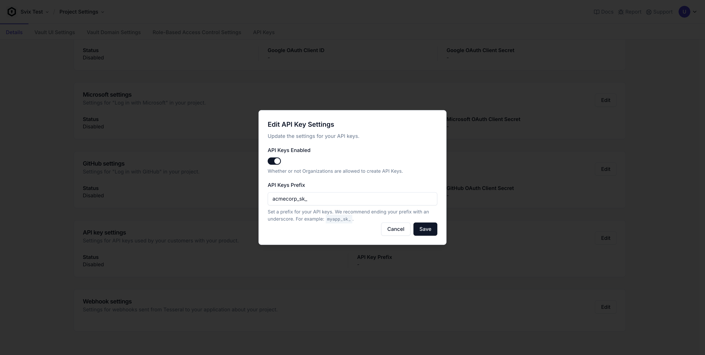

Tesseral can manage API keys for your product. With a single line of code, you
can opt into making endpoints that your customers can securely access over cURL
or HTTP.

## What are managed API Keys?

Tesseral not only provides secure authentication for
[Users](/docs/concepts/users), but it also supports secure API key
authentication. This allows your customers to call your endpoints using managed
API keys instead of user credentials. User credentials only work from a
individual's web browser, but API keys work with cURL or any other program.

When you enable this feature, Tesseral handles the generation of secure secret
tokens with 256-bit entropy. These tokens serve as authentication credentials
that your customers can safely use to access your API. Tesseral provides SDKs
that you can use to verify the authenticity of these secret tokens.

You have fine-grained control over where managed API keys are used. You can
enable them only on specific endpoints that you want to expose, maintaining
tight control over your API surface.

Managed API keys are fully integrated with Tesseral's [managed role-based access
control (RBAC)](/docs/features/role-based-access-control) feature. Your
customers can generate keys with scoped permissions, ensuring that each key only
has access to the resources it needs.

Enabling API key support on an endpoint typically requires no code changes to
that endpoint's code. You always have control over whether your code is
accessible to Users, API Keys, or both.

## Enabling Managed API Keys

To get started, you simply toggle the feature on at the project level. You can
also selectively enable it for individual organizations—allowing you to control
access or monetize it as needed.

### Configuring an API Key Prefix

<Frame caption="Configuring an API Key Prefix in the Tesseral Console">
  
</Frame>

Following a convention established by
[Stripe](https://docs.stripe.com/keys#obtain-api-keys), Tesseral's managed API
Keys are formatted as a long alphanumeric string with a prefix of your choosing.
You can configure this API Key Prefix from your [Project
Settings](https://console.tesseral.com/project-settings) in the Tesseral
Console.

For example, if your company is named ACMECorp, you might choose an API Key
prefix of `acmecorp_sk_`. Then your API Key secret tokens will look something
like:

```text
acmecorp_sk_vqvzz9m7pgxlrmcq025xf45k1hf4q9o4jfsqw99nyf5sojpicg6t0g9
```

### Enabling API Keys for an Organization

By default, Organizations in your [Project](/docs/concepts/projects) cannot
create API Keys. You must [enable API
Keys](/docs/concepts/organizations#api-keys-enabled) on an Organization to add
this functionality.

API Keys are not enabled by default because you may want to charge your
customers for access to this functionality.

### Get a Tesseral Backend API Key

Managed API Keys require use of the [Tesseral Backend
API](/docs/backend-api-reference/tesseral-backend-api) under the hood.
Tesseral's serverside SDKs will manage doing those calls for you, but you will
need a Tesseral Backend API Key to proceed.

You can create a Tesseral Backend API Key by following these steps:

1. Sign in to the [Tesseral Console](https://console.tesseral.com).

2. Make sure you're in the Project you want to work with. You can switch between
   Projects using the Project Switcher at the top left of the Console. 3. Go to
   your Project's [API Keys
   Settings](https://console.tesseral.com/project-settings/api-keys), and create a
   new Backend API Key.

3. When your Project API Key is created, you'll be given a
   chance to copy your Project API Key Secret Token. Keep this secret somewhere
   safe; it is sensitive.

You now have a Backend API Key Secret Token, which starts with:

```txt
tesseral_secret_key_...
```

Put this value in an environment variable called `TESSERAL_BACKEND_API_KEY`.

### Code Changes

API Keys are a serverside-only concept. You don't need to change your clientside
code at all to support API Keys. When you enable API Keys on an Organization,
your customers can view, create, revoke, and delete their API Keys from their
[Self-Serve Organization
Settings](/docs/features/self-serve-organization-settings).

Your serverside code will not support API Keys by default. To enable support for
API Keys, make a one-line change to your code:

<Tabs>
<Tab title="Express.js">
<Tip>
These instructions assume you've already set up [Tesseral for Express.js](/docs/sdks/serverside-sdks/tesseral-sdk-express).
</Tip>

```typescript {5}
// make sure you've configured TESSERAL_BACKEND_API_KEY
app.use(
  requireAuth({
    publishableKey: "publishable_key_...",
    enableApiKeys: true,
  }),
);
```

From there, all of your endpoints can now be called either by
[User](/docs/concepts/users) access tokens or by API Keys.

You can detect whether a request is from an API Key or an Access Token using
`credentialsType()`:

```typescript
import { credentialsType } from "@tesseral/tesseral-express";

app.get("/", (req, res) => {
  // credentialsType() returns "access_token" or "api_key"
  console.log(credentialsType(req))
});
```

These `@tesseral/tesseral-express` functions will work the same with either auth
type:

* [`organizationId()`](/docs/sdks/serverside-sdks/tesseral-sdk-express#getting-the-current-organization)
* [`credentials()`](/docs/sdks/serverside-sdks/tesseral-sdk-express#getting-the-requests-authenticated-credentials)
* [`hasPermission()`](/docs/features/role-based-access-control#permission-checks)

However,
[`accessTokenClaims()`](/docs/sdks/serverside-sdks/tesseral-sdk-express#getting-details-about-the-current-user)
will throw a `NotAnAccessTokenError` for requests that are from an API Key
instead of an access token. You can either `try / catch` for these errors, do an
`credentialsType` check before calling `accessTokenClaims()`.

</Tab>

<Tab title="Flask">
<Tip>
These instructions assume you've already set up [Tesseral for Flask](/docs/sdks/serverside-sdks/tesseral-sdk-flask).
</Tip>

```python {5}
# make sure you've configured TESSERAL_BACKEND_API_KEY
app.before_request(
    require_auth(
        publishable_key="publishable_key_...",
        enable_api_keys=True,
    )
)
```

Once enabled, your Flask routes can be authenticated with either
[User](/docs/concepts/users) access tokens or API Keys.

To detect the type of token in a request, use `credentials_type()`:

```python
from tesseral_flask import credentials_type

@app.route("/")
def home():
    # credentials_type() returns "access_token" or "api_key"
    print(credentials_type())
    return "ok"
```

These `tesseral_flask` functions will work the same with either auth type:

* [`organization_id()`](/docs/sdks/serverside-sdks/tesseral-sdk-flask#getting-the-current-organization)
* [`credentials()`](/docs/sdks/serverside-sdks/tesseral-sdk-flask#getting-the-requests-authenticated-credentials)
* [`has_permission()`](/docs/features/role-based-access-control#permission-checks)

If you call
[`access_token_claims()`](/docs/sdks/serverside-sdks/tesseral-sdk-flask#getting-details-about-the-current-user)
on an API Key-authenticated request, a `NotAnAccessTokenError` will be raised.
Wrap calls in `try / except`, or check `credentials_type()` beforehand.

</Tab>

<Tab title="Go">

<Tip>
These instructions assume you've already set up [Tesseral for Go](/docs/sdks/serverside-sdks/tesseral-sdk-go).
</Tip>

```go {5}
// make sure you've configured TESSERAL_BACKEND_API_KEY
http.ListenAndServe("...", auth.RequireAuth(
    server, 
    auth.WithPublishableKey("publishable_key_..."),
    auth.WithEnableAPIKeys(),
))
```

After enabling, your HTTP handlers will support both
[User](/docs/concepts/users) access tokens and API Keys.

To determine the auth type of a request, use `auth.CredentialsType(r)`:

```go
import "github.com/tesseral/tesseral-sdk-go/auth"

func(w http.ResponseWriter, r *http.Request) {
    ctx := r.Context()
    
    // auth.CredentialsType returns "access_token" or "api_key"
    fmt.Println(auth.CredentialsType(ctx))
}
```

These functions will behave the same regardless of the token type:

* [`OrganizationID()`](/docs/sdks/serverside-sdks/tesseral-sdk-go#getting-the-current-organization)
* [`Credentials()`](/docs/sdks/serverside-sdks/tesseral-sdk-go#getting-the-requests-authenticated-credentials)
* [`HasPermission()`](/docs/features/role-based-access-control#permission-checks)

Calling
[`AccessTokenClaims()`](/docs/sdks/serverside-sdks/tesseral-sdk-go#getting-details-about-the-current-user)
on an API Key-authenticated request will return a `ErrNotAnAccessToken` error.
Check `auth.CredentialsType(ctx)` before calling it or handle the error
explicitly.

</Tab>

</Tabs>
