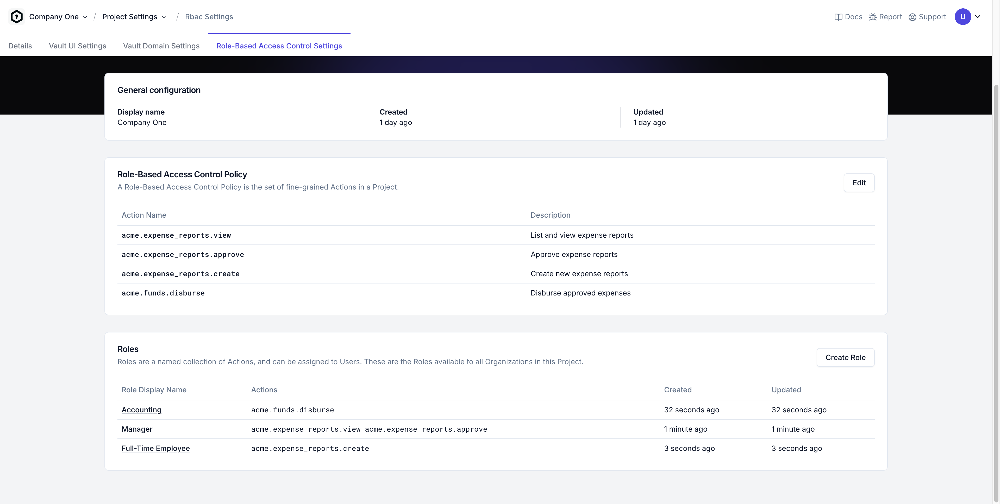
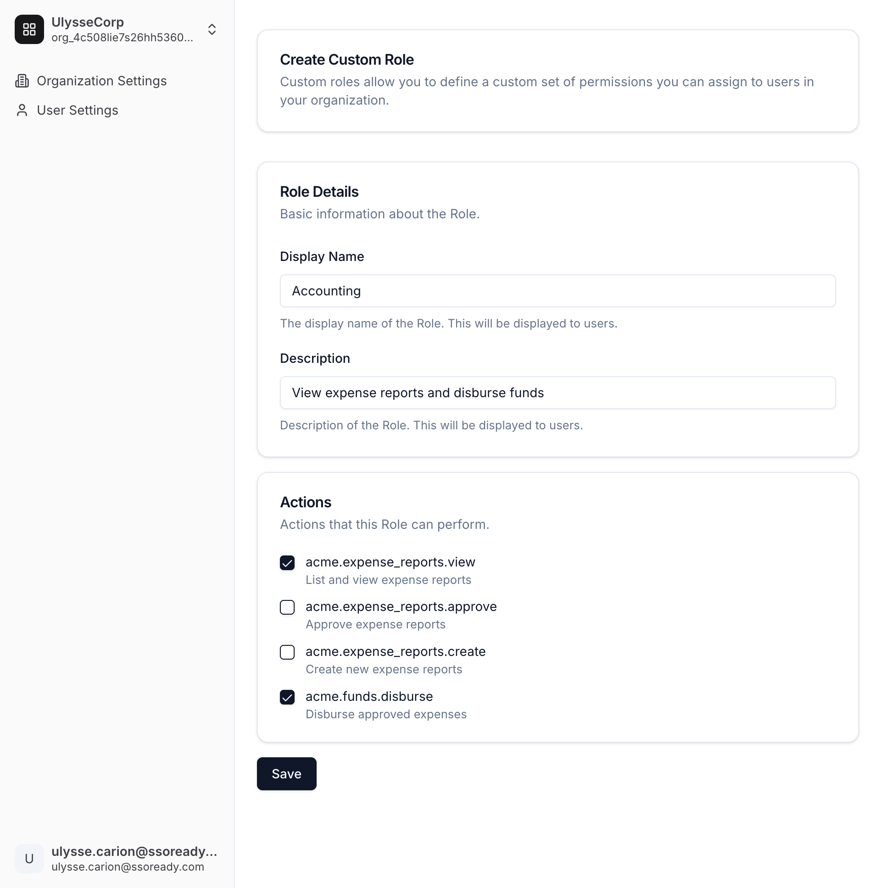
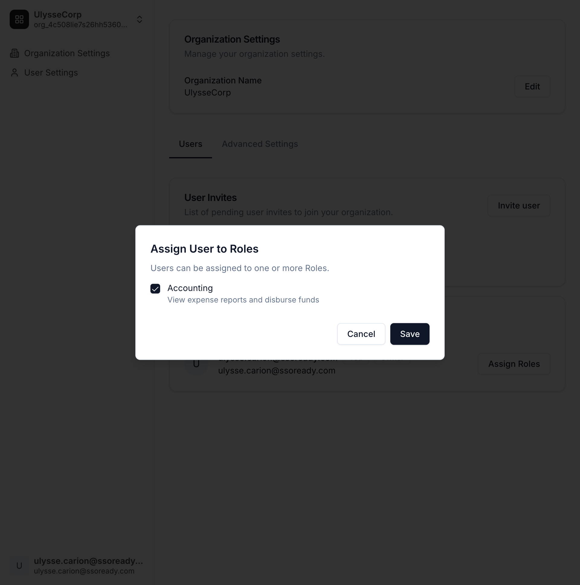
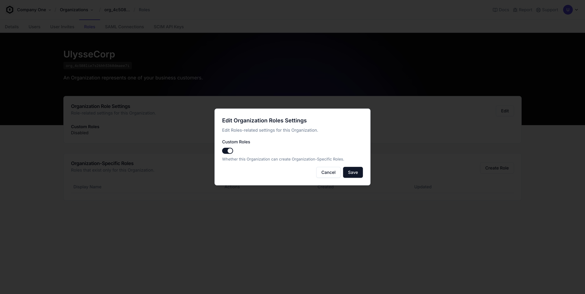

<Frame caption="Role-Based Access Control (RBAC) settings in the Tesseral Console.">
    
</Frame>

Role-Based Access Control ("RBAC") is the most common pattern for managing user
permissions in B2B applications. When you use Tesseral, most of the work of
supporting RBAC is done automatically for you.

## What is Role-Based Access Control?

The idea of Role-Based Access Control ("RBAC") is to introduce a notion of
[Roles](/docs/concepts/roles) in your product, which
[Users](/docs/concepts/users) can be assigned to. A User's permissions are based
on the Roles they have.

When you use Tesseral, you'll implement RBAC by following these steps:

1. Identify each of the specific fine-grained [Actions](#actions) in your
   product. This step is always specific to your product.

   For example, if you were making an expense management product, your product's
   Actions might be "creating expense reports", "approve expense reports", and
   "disburse funds".

   When [checking permissions](#permission-checks), you'll need to refer to those
   fine-grained Actions from within your code. So Actions have both a human-facing
   description (e.g. "View and approve expense reports") and a code-facing name
   (e.g. `acme.expense_reports.approve`).

2. Give all of your customers a set of [Roles](#roles) they can assign their
   Users to. Those Roles are going to be specific to your product, but usually map
   roughly onto a job title or department.

   For example, an expense management product might have a "Manager" role that has
   the `acme.expense_reports.approve` Action, and an "Accountant" role that has the
   `acme.funds.disburse` Action.

3. Your customers assign employees to Roles through their [Self-Serve
   Organization Settings](/docs/features/self-serve-organization-settings). You
   don't need to write any frontend or backend code related to assigning Users to
   Roles.

   When onboarding or providing support to customers, you can also assign Users to
   Roles through the Tesseral Console on behalf of your customers.

4. Whenever your code needs to check if a User has permission to do something,
   you always check whether the User has a given fine-grained action. See
   ["Permission Checks"](#permission-checks) below for the exact code you'll write.

As you grow, you'll eventually encounter customers who want Roles beyond the set
you defined in step (2). To accommodate this, you'll allow those customers to
use [Custom Roles](#custom-roles).

## RBAC Concepts

### Actions

An Action represents a fine-grained permission in your product. Every Action
consists of:

1. A code **Name**, such as `acme.expense_reports.approve`. 

   You should name your Actions in the form "service.resource.verb". Until your
   product becomes large enough that you have multiple product lines, you should
   just use the name of your product as the "service".

   For example, if your company is called ACME Corporation, and you want to
   represent the permission of being able to edit widgets, you might choose the
   name `acme.widgets.edit`.

   Action names must be of the form "x.y.z", where "x", "y", and "z" are all
   lowercase alphanumeric or underscore (`_`).

2. A **description**, that humans can use to understand what the Action bestows.

   For example, the description for an `acme.expense_reports.approve` Action might
   be "Approve and reject expense reports".

### RBAC Policy

Every Tesseral [Project](/docs/features/projects) has exactly one RBAC Policy.
An RBAC Policy is just a list of Actions.

You can add or remove Actions to your Project's RBAC Policy at any time.
Deleting an Action removes that Action from every [Role](#roles) in the Project.

### Roles

A Role represents a category of [User](/docs/features/users) in your product.
They usually roughly correspond to job titles. Every Role consists of:

1. A set of [Actions](#actions), such as `acme.expense_reports.approve`.
2. A **display name**, such as "Manager".
3. An optional **description**.

Users can be assigned to Roles. There is no limit to how many Users can be
assigned to a Role, nor on how many Roles a User may be assigned to.

Roles can either be Project-wide or Organization-specific. 

* Project-wide Roles are available to all
  [Organizations](/docs/concepts/organizations) in the Project, and can only be
  modified through the Tesseral Console or the [Tesseral Backend
  API](/docs/backend-api-reference).

* Organization-specific Roles are [custom Roles](#custom-roles). They can be
  modified through the Tesseral Console, the Tesseral Backend API, or by the
  [Owners](/docs/concepts/users#owner) of the Organization they belong to.

### Permission Checks

All of Tesseral's client-side and server-side SDKs give you a straightforward
function for checking a User's permissions.

<Tabs>

<Tab title="React">

<Tip>
These instructions assume you've already set up [Tesseral for React](/docs/sdks/clientside-sdks/tesseral-sdk-react).
</Tip>

Any time you need to check whether the current User is allowed to perform an
action, use `useHasPermission`:

```tsx {4,8}
import { useHasPermission } from "@tesseral/tesseral-react";

const Example = () => {
  const hasPermission = useHasPermission();

  return (
    <Button 
      disabled={!hasPermission("acme.expense_reports.approve")}
    >
      Approve Expense Report
    </Button>
  );
}
```

The function returned by `hasPermission` is fast and not resource intensive. You
can typically call it as often as you like with negligible performance impact.

</Tab>

<Tab title="Express.js">

<Tip>
These instructions assume you've already set up [Tesseral for Express.js](/docs/sdks/serverside-sdks/tesseral-sdk-express).
</Tip>

Any time you need to check whether the current User is allowed to perform an
action, use `hasPermission`:

```typescript {4}
import { hasPermission } from "@tesseral/tesseral-express";

app.get("/api/expense-reports/:id/approve", (req, res) => {
  if (!hasPermission(req, "acme.expense_reports.approve")) {
      // ...
  }
  // ...
});
```

`hasPermission` is fast and not resource intensive. You can typically call
`hasPermission` as often as you like with negligible performance impact.

</Tab>

<Tab title="Flask">

<Tip>
These instructions assume you've already set up [Tesseral for Flask](/docs/sdks/serverside-sdks/tesseral-sdk-flask).
</Tip>

Any time you need to check whether the current User is allowed to perform an
action, use `has_permission`:

```python {5}
from tesseral_flask import has_permission

@app.route("/api/expense-reports/<id>/approve")
def approve_expense_report(id):
   if not has_permission("acme.expense_reports.approve"):
      # ...
   # ...
```

`has_permission` is fast and not resource intensive. You can typically call
`has_permission` as often as you like with negligible performance impact.

</Tab>

<Tab title="FastAPI">

<Tip>
These instructions assume you've already set up [Tesseral for FastAPI](/docs/sdks/serverside-sdks/tesseral-sdk-fastapi).
</Tip>

Any time you need to check whether the current User is allowed to perform an
action, use `auth.has_permission`:

```python {4}
from fastapi import FastAPI, Depends
from tesseral_fastapi import Auth, get_auth

@app.get("/api/expense-reports/{id}/approve")
async def approve_expense_report(id: str, auth: Auth = Depends(get_auth)):
    if not auth.has_permission("acme.expense_reports.approve"):
        # ...
    # ...
```

`auth.has_permission` is fast and not resource intensive. You can typically call
`auth.has_permission` as often as you like with negligible performance impact.

</Tab>

<Tab title="Go">

<Tip>
These instructions assume you've already set up [Tesseral for Go](/docs/sdks/serverside-sdks/tesseral-sdk-go).
</Tip>

Any time you need to check whether the current User is allowed to perform an
action, use `auth.HasPermission`:

```go {6}
import "github.com/tesseral-labs/tesseral-sdk-go/auth"

func(w http.ResponseWriter, r *http.Request) {
    ctx := r.Context()

    if (!auth.HasPermission(ctx, "acme.expense_reports.approve")) {
        // ...
    }   
    // ...
}
```

`auth.HasPermission` is fast and not resource intensive. You can typically call
`auth.HasPermission` as often as you like with negligible performance impact.

</Tab>

<Tab title="Axum">

<Tip>
These instructions assume you've already set up [Tesseral for Axum](/docs/sdks/serverside/rust/axum).
</Tip>

Any time you need to check whether the current User is allowed to perform an
action, use `auth.has_permission`:

```rust {4}
use tesseral_axum::Auth;

async fn handler(auth: Auth) -> String {
    if !auth.has_permission("acme.expense_reports.approve") {
        // ...
    }

    // ...
}
```

`auth.has_permission` is fast and not resource intensive. You can typically call
`auth.has_permission` as often as you like with negligible performance impact.

</Tab>

</Tabs>

## Custom Roles

<Frame caption="A customer's perspective of creating a custom role, and assigning it to users">
    
    
</Frame>


Having too many Roles is overwhelming and confusing to customers, but some
customers will want very specific sets of actions available to certain
employees. These kinds of requests often come from your largest customers.

To address this, use custom Roles. Give all of your customers a general set of
actions that are broadly useful, and then grant specific
[Organizations](/docs/concepts/organizations) the ability to define Roles that
only they see. Custom Roles work just like ordinary Roles -- they have display
names, descriptions, and a set of [Actions](#actions) -- but they only exist for
a single Organization.

Your [permission checks](#permission-checks) will work exactly the same
regardless of whether a Role is Organization-specific or not. You do not need to
write or modify any code to support custom Roles.

When custom Roles are enabled for an Organization, your customer can create and
modify their custom Roles from their [self-serve Organization
settings](/docs/features/self-serve-organization-settings). You can also create
and modify custom Roles on your customer's behalf from the Tesseral Console.

### Enabling Custom Roles

<Frame caption="Enabling Custom Roles on an Organization from the Tesseral Console">
    
</Frame>

By default, Organizations in your [Project](/docs/concepts/projects) cannot
create custom Roles. You must [enable Custom
Roles](/docs/concepts/organizations#custom-roles-enabled) on an Organization to
add this functionality.

Custom Roles are not enabled by default because some customers may find them
confusing, and because you may want to charge your customers for access to this
functionality.

## Handling edge cases

<Note>
You don't need to implement every kind of permission check using RBAC. It's
normal to augment RBAC with additional logic for certain use-cases.
</Note>

Role-Based Access Control is the standard approach in B2B for most business
logic, but it's entirely normal for parts of your product to rely on additional
logic not captured entirely within RBAC:

* Some parts of your product might be gated behind payment. These kinds of
  billing-related permission checks are most often called "entitlements", and rely
  on an integration between your backend and your company's CRM (e.g. Salesforce,
  HubSpot) or payments system (e.g. Stripe).

  It's normal for your backend to perform *both* an RBAC check and an entitlement
  check on endpoints. On your frontend, it's helpful to know whether a request was
  denied from an entitlement vs RBAC, because you can show your customer an upsell
  (e.g. "Upgrade to Pro" or "Talk to Sales") when the issue is with entitlements.

* Some parts of your product might require custom permissions logic for specific
  actions. Your product might have notions of "assignees", "collaborators", or
  otherwise unique and complex resource hierarchies.

  It's normal for your backend to rely on both RBAC and your custom business logic
  to make authorization decisions in these cases. This approach gives you the
  ability to give your customers specific and relevant options when they run into
  permissions errors.

The unifying theme here is that you don't need to solve all of your permissions
problems with a single system. Some parts of your permissions model are
intrinsic to your product, and part of what makes it unique. When those
situations arise, you can use RBAC as a part of a broader solution.
