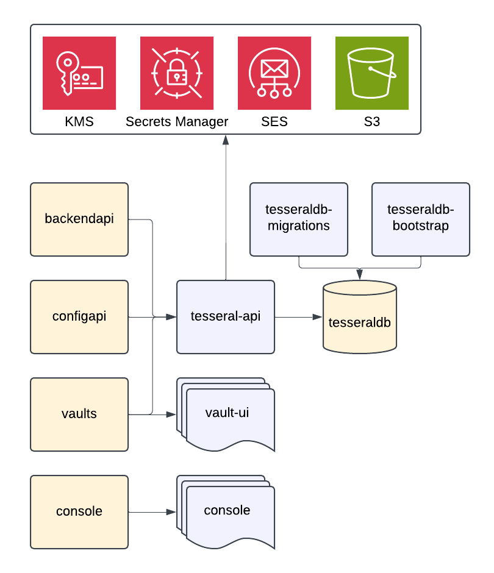

<Warning>

Self-hosting Tesseral is a very advanced use-case, and we are still working on
making the process of self-hosting easier.

If you are self-hosting Tesseral, please reach out to us at
`support@tesseral.com`. We will help you get this done, and help make sure your
deployment is secure.

</Warning>

Tesseral is an open-source project that you can self-host on your own
infrastructure. This document describes how you can do that.

## Tesseral Architecture

<Frame caption="An architecture diagram of Tesseral and its supporting AWS services. Purple components are code artifacts that Tesseral provides. Orange components are infrastructure components you must provision.">
  
</Frame>

Tesseral provides four artifacts that you can self-host:

* `tesseral-api` is a binary that represents the entire Tesseral backend
  codebase.

* `vault-ui` is a set of HTML, CSS, and JavaScript for the UI elements of
  Vaults.

* `console` is a set of HTML, CSS, and JavaScript for the Tesseral Console.

* `tesseraldb-migrations` is a set of database migrations for the Tesseral
  database.

* `tesseraldb-bootstrap` is an initialization script to initialize the Tesseral
  database after migrating it.

When you deploy Tesseral, you are responsible for managing the following
infrastructure:

* `backendapi` is the Tesseral Backend API, a reverse proxy that talks to
  `tesseral-api`. The hosted version of Tesseral runs this at
  `api.tesseral.com`.

* `confgapi` is the Tesseral Config API, a reverse proxy that talks to
  `tesseral-api`. The hosted version of Tesseral runs this at
  `config.tesseral.com`.

* `vaults` is the set of Tesseral Project Vaults, each of which is a reverse
  proxy that talks to `tesseral-api` or serves the `vault-ui` SPA, depending on
  the request path.

* `console` is a the Tesseral Console, a reverse proxy that serves the `console`
  SPA.

* `tesseraldb` is a PostgreSQL database.

The rest of this section describes these components in greater detail.

To follow these instructions, you must get a copy of the Tesseral source code,
available from GitHub at:

```text
https://github.com/tesseral-labs/tesseral
```

### AWS Infrastructure

Tesseral requires a set of AWS services. You do not need to run `tesseral-api`
or any other software component of Tesseral in AWS, but you do need to ensure
`tesseral-api` has access to the following AWS services:

* [AWS Secrets Manager](https://aws.amazon.com/secrets-manager/) is optional but
  strongly recommended as a place to keep any secret environment variables
  `tesseral-api` requires.

* [AWS Key Management Service](https://aws.amazon.com/kms/) is a required, and
  is used to encrypt session signing keys and OAuth client IDs.

* [Amazon Simple Email Service](https://aws.amazon.com/ses/) is required for
  sending email verification codes to end users.

* [Amazon S3](https://aws.amazon.com/s3/) is required for storing user content,
  such as Project logos.

### `tesseral-api`

`tesseral-api` is distributed as a binary, written in Golang. To build this
binary for your operating system and architecture, you must first install Golang
and then run:

```bash
# set GOOS and GOARCH as appropriate
go build -o api ./cmd/api
```

This will produce an `api` binary. For documentation on the environment
variables `api` takes, run `api --help`. The most important environment
variables are:

| Environment Variable Name                       | Value                                                             | Example Value                        |
|-------------------------------------------------|-------------------------------------------------------------------|--------------------------------------|
| `API_SERVE_ADDR`                                | The address `api` should serve on.                                | `:8080`                              |
| `API_CONSOLE_DOMAIN`                            | The public domain for `console`. Presumed to be HTTPS.            | `console.tesseral.com`               |
| `API_DB_DSN`                                    | PostgreSQL connection string for `tesseraldb`.                    | `postgresql://...`                   |
| `API_DOGFOOD_PROJECT_ID`                        | The ID of the dogfood project created by `tesseral-bootstrap`.    | `project_...`                        |
| `API_SESSION_KMS_KEY_ID`                        | An AWS KMS Key ID for encrypting session signing keys.            | An AWS-generated UUID.               |
| `API_GOOGLE_OAUTH_CLIENT_SECRETS_KMS_KEY_ID`    | An AWS KMS Key ID for encrypting Google OAuth Client secrets.     | An AWS-generated UUID.               |
| `API_MICROSOFT_OAUTH_CLIENT_SECRETS_KMS_KEY_ID` | An AWS KMS Key ID for encrypting Microsoft OAuth Client secrets.  | An AWS-generated UUID.               |
| `API_S3_USER_CONTENT_BUCKET_NAME`               | The name of an S3 bucket for holding onto Project logos.          | `tesseral-usercontent`               |
| `API_USER_CONTENT_BASE_URL`                     | A public URL that serves content from the user content S3 bucket. | `https://tesseral-user-content.com/` |

### `vault-ui`

`vault-ui` is distributed as a set of static files. To build these files, run:

```bash
cd vault-ui
npm ci
npm run build
```

This will produce the files to serve to `vault-ui/public`.

### `console` (Single-Page Application)

`console` is distributed as a set of static files. To build these files, you
will first need to run [`tesseral-bootstrap`](#tesseral-bootstrap). Then run:

```bash
cd console
npm ci

# Replace project_... with the project ID outputted by tesseral-bootstrap
CONSOLE_DOGFOOD_PROJECT_ID=project_... npm run build
```

This will produce the files to serve to `console/public`.

### `tesseraldb-migrations`

To prepare the database tables in `tesseraldb`, you will need to install
[`golang-migrate`](https://github.com/golang-migrate/migrate). Then run:

```bash
migrate -path cmd/openauthctl/migrations -database "postgres://..." up
```

Where `postgres://...` is a connection string to `tesseraldb`.

### `tesseral-bootstrap`

After having run `tesseraldb-migrations`, you must run `tesseral-bootstrap` to
initialize a "dogfood" project. This is a special initial project that Tesseral
uses to authenticate users of the Tesseral Console.

```bash
go run ./cmd/openauthctl bootstrap \
  --database "postgres://..." \
  --root-user-email "root@example.com" \
  --session-kms-key-id "..." \
  --console-domain "..." \
  --vault-domain "..."
```

For these parameters:

* Have `--database` point to `tesseraldb`.

* Have `--root-user-email` be an email address you have access to.

* `session-kms-key-id` should be the same value you use for
  `API_SESSION_KMS_KEY_ID` in `tesseral-api`.

* `console-domain` should be the same value you use for `API_CONSOLE_DOMAIN` in
  `tesseral-api`.

* `vault-domain` should be the domain name of the vault you want to use for the
  initial, dogfood project. This must be a subdomain of `console-domain`. In the
  hosted version of Tesseral, this is `vault.console.tesseral.com`.

### `backendapi`

`backendapi` must be a reverse proxy (e.g. an nginx, a Cloudflare worker, an AWS
Cloudfront distribution or API Gateway) that:

* Is available from the public internet.
* Serves HTTPS.
* Performs no caching.
* Forwards all requests to `tesseral-api`, but prepends `/api/backend` to all
  request paths.

As a non-normative starting point, an nginx configuration for this may look
like:

```text
server {
  location / {
    proxy_pass https://tesseral-api.example.com/api/backend/;
  }
}
```

### `configapi`

`configapi` must be a reverse proxy (e.g. an nginx, a Cloudflare worker, an AWS
Cloudfront distribution or API Gateway) that:

* Is available from the public internet.
* Serves HTTPS.
* Performs no caching.
* Forwards all requests to `tesseral-api`, but prepends `/api/config-api` to all
  request paths.

As a non-normative starting point, an nginx configuration for this may look
like:

```text
server {
  location / {
    proxy_pass https://tesseral-api.example.com/api/config-api/;
  }
}
```

### `vaults`

Tesseral is multi-tenant software; every self-hosted deployment of Tesseral
supports running multiple Projects at once. Every Tesseral Project has a Vault,
and each of these Vaults (collectively referred to as `vaults` in this article)
must point at the same reverse proxy.

How you achieve this architecture is up to you; in the cloud-hosted version,
Tesseral operates a wildcard subdomain (`*.tesseral.app`) for
"Tesseral-generated" subdomains, as well as a proxy supporting user-provided
domains.

`vaults` must be a reverse proxy (e.g. an nginx, a Cloudflare worker, an AWS
Cloudfront distribution or API Gateway) that:

* Is available from the public internet.
* Serves HTTPS.
* Forwards, without caching, all requests beginning in `/api` or `/.well-known`
  to `tesseral-api`.
* Serves a single-page application for all other requests, serving the contents 
  of `vault-ui`. All 404s must serve `index.html`.

### `console` (Reverse Proxy)

`vaults` must be a reverse proxy (e.g. an nginx, a Cloudflare worker, an AWS
Cloudfront distribution or API Gateway) that:

* Is available from the public internet.
* Serves HTTPS.
* Serves a single-page application for all requests, serving the contents of
  `vault-ui`. All 404s must serve `index.html`.

### `tesseraldb`

`tesseraldb` must be a PostgreSQL database or cluster, running version 16.4 or
later. `tesseraldb-migrations` and `tesseral-bootstrap` both require one-off
access to this database; thereafter, only `tesseral-api` needs to have network
connectivity to this database.

## Using Tesseral SDKs

Tesseral's clientside and serverside SDKs default to using the cloud-hosted
version of Tesseral. All of Tesseral's SDKs support overriding this
configuration to use your self-hosted instance instead.

For the Tesseral React SDK, override the `configapi` domain (default:
`config.tesseral.com`) using the `configApiHostname` parameter on
`TesseralProvider`:

```typescript
<TesseralProvider configApiHostname="config.tesseral-self-hosted.example.com" publishableKey="publishable_key_...">
  <App />
</TesseralProvider>
```

For all backend SDKs, override the `backendapi` domain (default:
`api.tesseral.com`) by providing an additional parameter when constructing a
client instance:

<Tabs>
  <Tab title="Node">
    ```typescript
    const client = new TesseralClient({
      environment: "https://api.tesseral-self-hosted.example.com/",
      // ...
    })
    ```
  </Tab>

  <Tab title="Python">
    ```python
    # this also works with AsyncTesseral
    client = Tesseral(
      base_url="https://api.tesseral-self-hosted.example.com/",
      # ...
    )
    ```
  </Tab>

  <Tab title="Go">
    ```go
    import (
        tesseraloptions "github.com/tesseral-labs/tesseral-sdk-go/options"
        tesseralclient "github.com/tesseral-labs/tesseral-sdk-go/client"
    )

    tesseralClient := tesseralclient.NewClient(
      tesseraloptions.WithBaseURL("https://api.tesseral-self-hosted.example.com/"),
      // ...
    )
    ```
  </Tab>
</Tabs>
