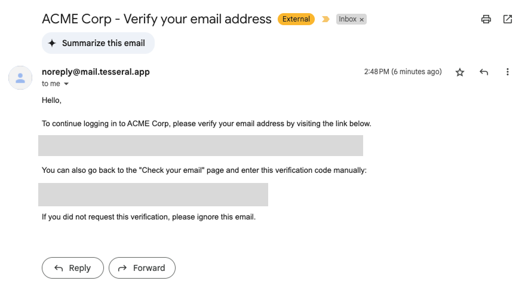
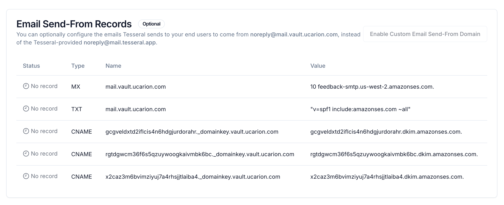

Tesseral handles authentication-related emails, such as for email verification
or password resetting, on your behalf. Emails of this kind are commonly referred
to as "transactional" (as opposed to "marketing").

## Emails 

<Frame caption="An example of a transactional email sent by Tesseral">
  
</Frame>

Tesseral sends emails on your behalf in order in two circumstances:

1. User email addresses are always verified in Tesseral. When someone is logging
   into your application, Tesseral may send an email verification challenge to
   their email address.

2. When someone requests a password reset, Tesseral sends them an email
   containing a password reset code.

## Customizing the email address Tesseral sends from

By default, Tesseral will send emails to your users from the email address
`noreply@mail.tesseral.app`. You can customize this email address to come from
the same domain as your Vault.

<Frame caption="DNS Settings for a custom transactional email address">
  
</Frame>

Tesseral will automatically monitor your DNS records, and will report back to
you all missing or incorrect DNS records you need.

Tesseral requires the following DNS records, all of which exist to make sure
your transactional emails are reliably accepted by all major email providers:

1. An **MX Record** so that Tesseral can receive any bounce and complaint
   notifications from email providers. This is necessary to reliably send emails
   that Gmail, Outlook, and other providers will accept as non-spam.

2. A **TXT Record**, called an ["SPF
   Record"](https://datatracker.ietf.org/doc/html/rfc7208), that email providers
   use to authenticate the emails Tesseral sends on your behalf.

3. Three **CNAME Records**, called ["DKIM
   Records"](https://en.wikipedia.org/wiki/DomainKeys_Identified_Mail), that
   Tesseral uses to cryptographically sign emails. Email providers use these to
   ensure Tesseral-sent emails can't be spoofed.

After you've configured your DNS records, these records need to be widely
propagated before Tesseral can begin sending emails on your behalf. This
typically requires less than an hour.
