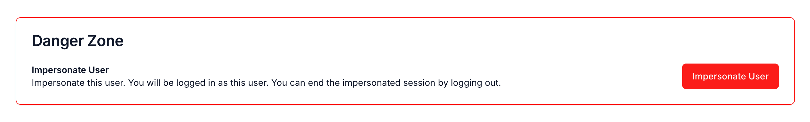

Tesseral supports user impersonation, which allows select members of your
Tesseral Project to temporarily log in as one of your Users.

User impersonation allows you to see your product from the perspective of your
User. This is typically most useful for product onboarding, customer support,
and reproducing bugs.

## Impersonating a user

<Frame caption="A screenshot of the user impersonation menu">
  
</Frame>

To impersonate a User, you must be an Owner of your Tesseral Project. You can
then navigate to a User in your Project, and go to the "Danger Zone" section,
and click on "Impersonate User".

Tesseral will grant you a session as the impersonated User, and redirect you to
your product. Actions you take now will be associated with the impersonated
User.

To end an impersonated session, log out of your product.
