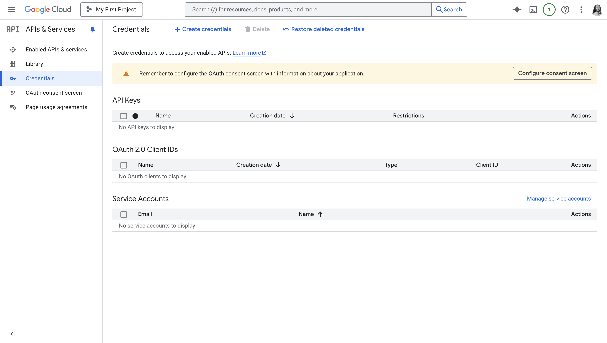
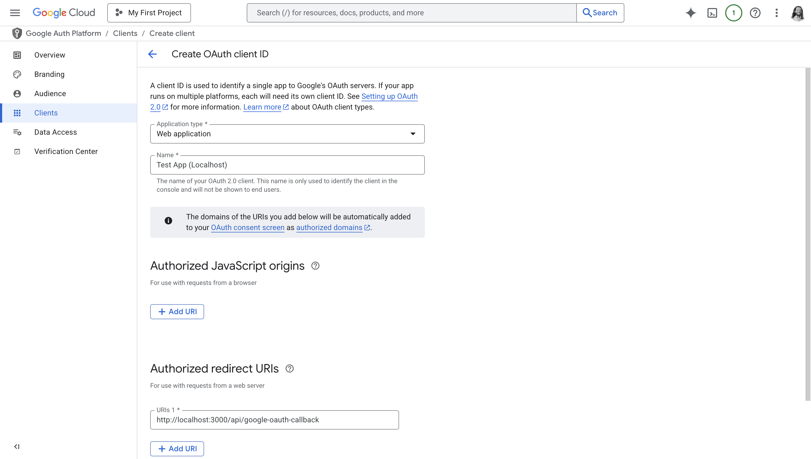

Adding Log in with Google to your Tesseral [Project](/docs/concepts/projects)
gives your customers the ability to use their Google account to log into your
product. Configuring Log in with Google doesn't require any code.

## Configuring Log in with Google

To configure Log in with Google, you must enable it on your
[Project](/docs/concepts/projects). You will need to get a [Google OAuth Client
ID and Secret](#getting-a-google-oauth-client-id-and-secret) if you don't have
one already. If you have an existing Google OAuth client, you will need to make
sure to [add an authorized redirect URI](#add-an-authorized-redirect-uri) to
that client.

Once you have a Google OAuth Client ID and Secret, go to your [Project
Settings](https://console.tesseral.com/project-settings) page in the Tesseral
Console. Go to **Google settings**, and click **Edit**:

1. Switch **Log in with Google** on.

2. Under **Google OAuth Client ID**, input your [Google OAuth Client
   ID](#copy-your-oauth-client-id-and-secret).

3. Under **Google OAuth Client Secret**, input your [Google OAuth Client
   Secret](#copy-your-oauth-client-id-and-secret).

4. Click **Save**.

You have now enabled Log in with Google for your Project. All new
[Organizations](/docs/concepts/organizations) will have Log in with Google
enabled by default. You can now [enable or disable Log in with
Google](#toggling-log-in-with-google-for-an-organization) on a per-Organization
level.

### Getting a Google OAuth Client ID and Secret

To enable Log in with Google, you must to register an "OAuth application" with
Google. This is a requirement that comes from Google. This section will detail
exactly how you do that, step-by-step.

Before you start, you'll need to know your Project's Vault Domain. You can find
this under "Current Vault Domain" in your Project's [Vault Domain
Settings](https://console.tesseral.com/project-settings/vault-domain-settings).

<Steps>

<Step>

#### Go to Google Cloud Console Credentials

<Frame caption="Google Cloud Console Credentials page">
  
</Frame>

Visit the [Credentials](https://console.cloud.google.com/apis/credentials)
section of the Google Cloud Console.

<Note>

Take note of what account you're currently logged into in Google Cloud Console.
Your current account is displayed at the top right. If you have work and
personal Google accounts, make sure you're logged in as your work account.

</Note>

Google Cloud is Google's competitor to Amazon Web Services and Microsoft Azure,
but you don't need to use any of Google's cloud services to use Log in with
Google. These instructions will guide you every step of the way.

Click on the **Create Credentials** button. From the dropdown, choose **OAuth
client ID**.

</Step>

<Step>

#### Configure your OAuth Consent Screen

If Google tells you to configure your consent screen, click on the **Configure
Consent Screen** button, or follow [this
link](https://console.cloud.google.com/auth/branding) to your project's Google
Auth Platform Branding settings.

If a **Get started** button is present, click on it. Follow the questions Google
asks. A few points to note:

1. Your **App Name** is public-facing. Your users will see it when they're
   logging in. You should use your company's name. Don't include "Google" in the
   name.

2. When choosing your **Audience**, choose **External**.

Once you're done, go back to
[Credentials](https://console.cloud.google.com/apis/credentials) again, and
click on **Create Credentials** and **OAuth client ID** again.

</Step>

<Step>

#### Configure your OAuth Client

<Frame caption="Creating an OAuth Client">
  
</Frame>

Under **Application type**, choose **Web application**.

</Step>

<Step>

#### Add an Authorized Redirect URI

You can ignore **Authorized JavaScript origins**. 

Under **Authorized redirect URIs**, click "Add URI" and input:

```
https://VAULT_DOMAIN/google-oauth-callback
```

Where `VAULT_DOMAIN` is your Project's Vault Domain. You can find your Project's
Vault Domain under "Current Vault Domain" in your Project's [Vault Domain
Settings](https://console.tesseral.com/project-settings/vault-domain-settings).

| Example Current Vault Domain | Authorized Redirect URI you should input                 |
|------------------------------|----------------------------------------------------------|
| `project-xxx.tesseral.app`   | `https://project-xxx.tesseral.app/google-oauth-callback` |
| `vault.company.com`          | `https://vault.company.com/google-oauth-callback`        |

Click **Create**. Google says it may take "a few hours" to take effect; in
practice creating or modifying an OAUth client is almost always instantaneous.

#### Copy your OAuth Client ID and secret

After clicking "Create", Google shows you your new OAuth Client's ID and Secret.

If you accidentally close this modal, or need to come back to it later, you can
see this information again by going to the
[Credentials](https://console.cloud.google.com/apis/credentials), and clicking
on your client under "OAuth 2.0 Client IDs".

Your Google OAuth Client ID typically ends in `apps.googleusercontent.com`. It
is public and not sensitive; you can give this value out to anyone.

Your Google OAuth Client secret typically starts in `GOCSPX`.

</Step>

</Steps>

## Managing Log in with Google

Once you have enabled Log in with Google on your
[Project](/docs/concepts/projects), all new
[Organizations](/docs/concepts/organizations) in your Project will support Log
in with Google. Existing Organizations' login methods are not changed
automatically.

### Toggling Log in with Google for an Organization

Once you have enabled Log in with Google on your Project, you can enable or
disable Log in with Google for individual Organizations in your Project from the
[Tesseral Console](https://console.tesseral.com) or using the
[`UpdateOrganization`](/docs/backend-api-reference/api-reference/organizations/update-organization)
Backend API endpoint.

Your customer can self-serve enable or disable Log in with Google from their
[Self-Serve Organization
Settings](/docs/features/self-serve-organization-settings).

When Log in with Google is disabled for an Organization, then
[Users](/docs/concepts/users) cannot log into that Organization using Log in
with Google. Users will be required to use a different login method to access
the Organization. Other Organizations are not affected.

## Log in with Google and Enterprise Single Sign-On (SAML)

It's common for growing companies to initially want to Log in with Google, and
then switch to [Enterprise Single Sign-On (SAML)](/docs/features/saml-sso). That
process usually looks like this:

1. Your customer has an [Organization](/docs/concepts/organizations) in your
   [Project](/docs/concepts/projects), and Log in with Google is enabled on their
   Organization.

2. Your customer eventually outgrows Log in with Google. Usually,
   this is because your customer wants better control over which employees can
   access your product, or because they have compliance obligations to use SAML
   everywhere.

3. You enable ["Log in with SAML"](/docs/login-methods/primary-factors/log-in-with-enterprise-sso-saml) for their Organization.

   Customers cannot enable Log in with SAML entirely on their own; you must first
   enable it for their Organization. You may choose to only enable SAML for
   certain paying customers.

4. Your customer configures SAML using their [Self-Serve Organization
   Settings](/docs/features/self-serve-organization-settings). They can now log
   in with SAML.

5. Your customer tells their employees to expect to have to start using SAML to
   log into your product. During a transitional period, your customer uses both
   Log in with Google and Log in with SAML.

6. When your customer is ready to use Log in with SAML exclusively, they turn
   off Log in with Google for their Organization using their Self-Serve
   Organization Settings.

   Once your customer disables all login methods except SAML, then SAML becomes the
   only way your customer's employees can log into your product. This is the
   desired state for most large companies.

Every step of this process can be self-serve for your customers. You can also
carry out these steps on behalf of your customer using the [Tesseral
Console](https://console.tesseral.com). No step of this process requires writing
any code.

## Using Additional Google APIs

<Tip>

If you aren't interested in reading or writing your users' Gmail, Google
Calendar, Google Drive, or other personal data hosted by Google, then you can
ignore this section.

</Tip>

You can use Log in with Google in concert with other Google APIs. This section
describes how to "upgrade" your access of Google data from the very basic
information required for Log in with Google.

### Registering additional scopes

Google controls which APIs you can use based on "OAuth scopes". You can
configure the scopes your application is allowed to ask for by registering these
scopes to your application. 

If you wish to access your user's Google data -- such as their Gmail, Calendar,
or Drive -- then it's likely Google will consider your data access level to be
"sensitive" or "restricted". When you register these scopes, you will be subject
to [Sensitive and Restricted Scope
Verification](/docs/technical-concepts/log-in-with-google#sensitive-and-restricted-scope-verification).
Google will prevent you from going to production until you complete this
process; expect delays of a week to months, depending on the sensitivity of the
data you request.

To register scopes to your application, and to see if those scopes are subject
to Sensitive or Restricted Scope Verification, see [this
guide](/docs/technical-concepts/log-in-with-google#determining-if-a-scope-is-sensitive-or-restricted).

When you enable Log in with Google on your Tesseral
[Project](/docs/concepts/projects), Tesseral's login flow will only request the
least sensitive scopes. These scopes are considered non-sensitive by Google, and
are never subject to Sensitive or Restricted Scope Verification.

### Requesting additional scopes

Your frontend can, at any time, request scopes from your users. You can do so
using ["Incremental
Authorization"](/docs/technical-concepts/log-in-with-google#incremental-authorization).
Incremental authorization allows you to ask for further permissions from Google
users even after you may have for some permissions previously.

You should use incremental authorization to ask for additional scopes beyond the
very basic, non-sensitive ones that Tesseral requests to implement Log in with
Google. You can use the same OAuth client you [configured in
Tesseral](#configuring-log-in-with-google) to later request additional
permissions.

Tesseral does not support requesting additional scopes as part of your Log in
with Google flow, because doing so will imperil your [Sensitive and Restricted
Scope
Verification](/docs/technical-concepts/log-in-with-google#sensitive-and-restricted-scope-verification)
process. In that process, Google will manually observe what your login and
permissions flow looks like, and Google does not approve of applications asking
for invasive permissions right from a login flow.

If you're familiar with [Google's OAuth
flow](/docs/technical-concepts/log-in-with-google#elements-of-a-google-oauth-flow)
already, then implementing incremental authorization is as simple as including a
`&include_granted_scopes=true` query param to the [Authorization
Endpoint](/docs/technical-concepts/log-in-with-google#authorization-endpoint-parameters).
The rest of the process is otherwise unchanged.

### Using Google APIs "offline" or in the background

When you enable Log in with Google on your Tesseral
[Project](/docs/concepts/projects), Tesseral's login flow will only ask for
"online" access to non-sensitive details about the user. You can upgrade that
access from your own application.

Your frontend can, at any time, [request additional
scopes](#requesting-additional-scopes) from your user. You can also request
"offline access", which allows you to perform [background activity using
`refresh_tokens`](/docs/technical-concepts/log-in-with-google#background-activity-with-refresh-tokens).
