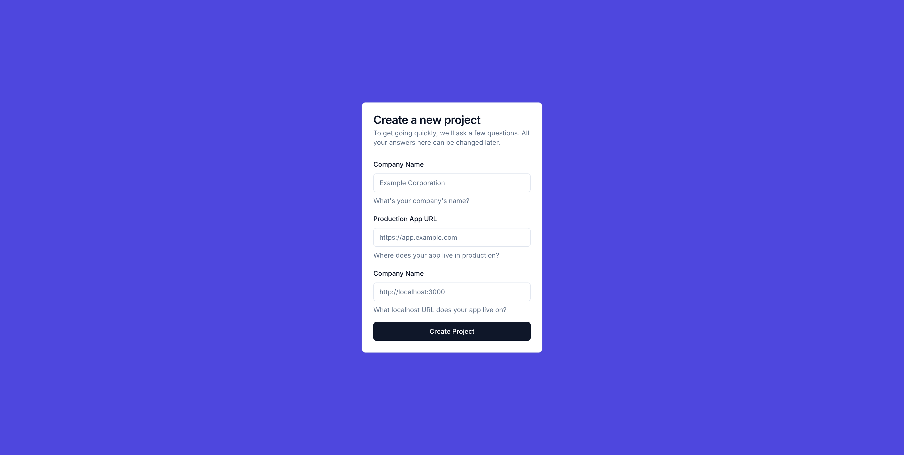

# Sign up for Tesseral

Go to https://console.tesseral.com and sign up. At a step in the flow, you'll be
asked to Create a Project.

<Frame caption="Create a Project">
  
</Frame>

You can change your choices here later. The important thing is:

* **Production App URL** is the URL where your production app lives. 
  
  Typically, this is something like `https://app.company.com` (sometimes `app.` is
  instead something like `console.` or `dashboard.`), but some applications put it
  on `https://company.com`. Put whatever style you use; Tesseral supports them
  all.

* **Development App URL** is the URL where your app lives when you're developing
  on it locally.

  Choose something like `http://localhost:3000`. If you have a setup where you run
  live previews on some kind of preview URL, then you can add those later. Start
  by adding just your localhost domain.

After you complete this step, Tesseral will automatically create two Tesseral
Projects for you: a production Project and a development Project (whose name
ends in "Dev"). 

You'll be logged into your development Project. You can switch between your
Projects from the Project Switcher at the top left of the Console.

# Add Tesseral to your clientside code

Tesseral's React SDK handles redirecting users to your login page, giving your
React code hooks like `useUser()` or `useLogout()`, and having your frontend
automatically send authentication information in its requests to your server.

<Steps>
  <Step title="Install Tesseral's React SDK">
    Install the Tesseral React SDK by running:

    ```bash
    npm install @tesseral/tesseral-react
    ```
  </Step>

  <Step title="Get your Dev Mode publishable key">
    Go to https://console.tesseral.com/project-settings/api-keys and click on
    "Create" under "Publishable Keys". Make sure to enable "Dev Mode" on the
    publishable key.

    You'll need the ID of your new publishable key for the next step. It starts with
    `publishable_key_...`.
  </Step>

  <Step title="Add `TesseralProvider` to your app">
    Find your clientside React root, and add `TesseralProvider` there, with the
    publishable key ID from the previous step as the `publishableKey` prop:

    ```typescript {7,9}
    import { createRoot } from "react-dom/client";
    import { TesseralProvider } from "@tesseral/tesseral-react";

    const root = createRoot(...);
    root.render(
      // use the publishable_key_... you got in Step 2
      <TesseralProvider publishableKey="publishable_key_...">
        <App />
      </TesseralProvider>
    );
    ```

    Now, when you visit your webapp, your customers will automatically be redirected
    to a Tesseral-hosted login flow if they're not already logged in.
  </Step>

  <Step title="Add an access token to all your requests to your backend API">
    Your webapp now has a login gate. The last step is to make your React code's
    requests to your backend include proof that they're legitimately logged in.

    Take every place where your code sends `fetch` / `axios` / etc requests to your
    backend, and call `useAccessToken()` to add an `Authorization` header to those
    requests:


    <CodeBlocks>
    ```typescript {9} title="Example with fetch"
    import { useAccessToken } from "@tesseral/tesseral-react";

    const useFetch = (...) => {
      const accessToken = useAccessToken()
  
      fetch("...", {
        // ...
        headers: {
          Authorization: `Bearer ${accessToken}`
        },
      });
    }
    ```

    ```typescript {9} title="Example with axios"
    import { useAccessToken } from "@tesseral/tesseral-react";
    
    const useAxiosClient = (...) => {
      const accessToken = useAccessToken();

      return axios.create({
        // ...
        headers: {
          Authorization: `Bearer ${accessToken}`,
        },
      });
    }
    ```
    </CodeBlocks>
  </Step>
</Steps>

# Add Tesseral to your serverside code

<Note>
  We're working on more batteries-included backend SDKs. What you're seeing below
  are our low-level SDKs. We are aware that these require too much work to set up.
</Note>

Tesseral provides SDKs for Python, Node (and Bun, Deno, etc.), and Golang
backends. Install those SDKs and use them to authenticate all requests that go
by. You'll need the Publishable Key you created previously.

<Tabs>
  <Tab title="Node">
    <Info>
      These instructions focus on Node.js, but Bun and Deno are supported too.
    </Info>

    Install the Tesseral Node.js SDK by running:

    ```bash
    npm install @tesseral/tesseral-node
    ```

    And then create a `TesseralAuthenticator`:

    ```typescript
    import { TesseralAuthenticator } from "@tesseral/tesseral-node";

    const authenticator = new TesseralAuthenticator({ publishableKey: "publishable_key_..." })
    ```

    To authenticate requests that go by, run `authenticateAccessToken` on every
    request that goes by:

    ```typescript
    // adapt this to how you do http server middleware in your project
    async function middleware(request) {
      try {
        await authenticator.authenticateAccessToken({ 
          accessToken: request.headers["Authorization"].replace("Bearer ", ""), 
        })
      } catch {
        return "401 Unauthorized";
      }
    }
    ```
  </Tab>

  <Tab title="Python">
    Install the Tesseral Python SDK by running:

    ```bash
    pip install tesseral
    ```

    And then create a Tesseral `Authenticator` or `AsyncAuthenticator`:

    ```python
    import TesseralAuthenticator from tesseral.authenticator

    authenticator = TesseralAuthenticator(publishable_key="publishable_key_...")
    ```

    To authenticate requests that go by, run `authenticate_access_token` on every
    request that goes by:

    ```python
    # adapt this to how you do http server middleware in your project
    def middleware(request):
        try:
            authenticator.authenticate_access_token(request.headers["Authorization"].removeprefix("Bearer "))
        except:
            return "401 Unauthorized"
    ```
  </Tab>

  <Tab title="Go">
    Install the Tesseral Python SDK by running:

    ```bash
    go get github.com/tesseral-labs/tesseral-sdk-go
    ```

    And then create a Tesseral `Authenticator`:

    ```go
    import "github.com/tesseral-labs/tesseral-sdk-go/authenticator"

    auth := authenticator.NewAuthenticator(authenticator.WithPublishableKey("publishable_key_..."))
    ```

    To authenticate requests that go by, run `AuthenticateAccessToken` on every
    request that goes by:

    ```go
    func withAuthentication(h http.Handler) http.Handler {
        return http.HandlerFunc(func (w http.ResponseWriter, r *http.Request)) {
            if err := auth.AuthenticateAccessToken(strings.StripPrefix("Bearer ", r.Header.Get("Authorization")); err != nil {
                w.WriteHeader(http.StatusUnauthorized)
                return;
            }

            h.ServeHTTP(w, r)
        })
    }
    ```
  </Tab>
</Tabs>

# Going to Production

Go to the Tesseral Console. Click on the Project Switcher at the top left, and
click on your production Project (it's the one whose name doesn't end in "Dev").

Go to Project Settings, and then the "Vault Domain Settings" tab. Click on
"Edit", and under "Custom Vault Domain" you'll input `vault.XXX`, where `XXX` is
the domain of your App Production URL.

You'll now get a set of DNS records you need to set up. Create those DNS
records. Once those records are all correct and widely propagated, you can
enable your Custom Vault Domain.

Now, when your customers are redirected to their login page, they'll see
`vault.app.company.com` instead of the domain Tesseral automatically generated
for your Project.
