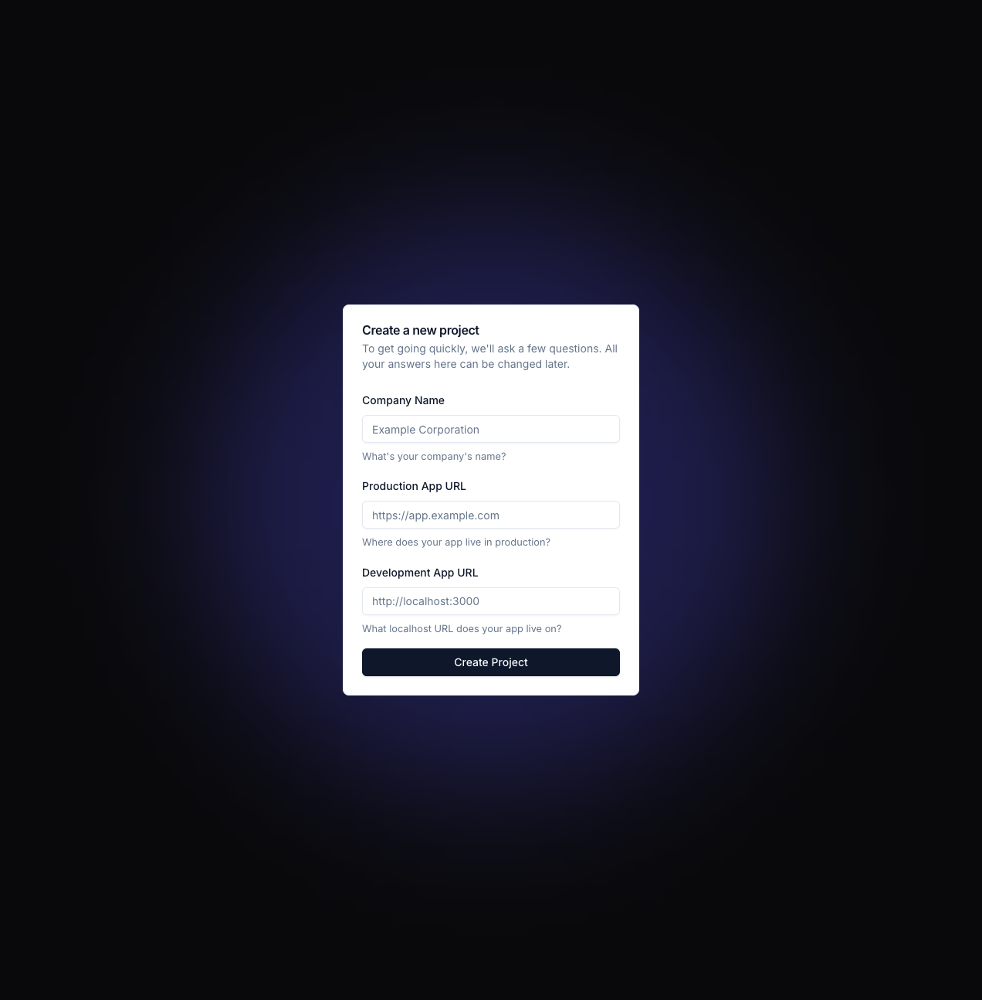

# Sign up for Tesseral

Go to https://console.tesseral.com and sign up. At a step in the flow, you'll be
asked to Create a Project.

<Frame caption="Create a Project">
  
</Frame>

You can change your choices here later. The important thing is:

* **Production App URL** is the URL where your production app lives. 
  
  Typically, this is something like `https://app.company.com` (sometimes `app.` is
  instead something like `console.` or `dashboard.`), but some applications put it
  on `https://company.com`. Put whatever style you use; Tesseral supports them
  all.

* **Development App URL** is the URL where your app lives when you're developing
  on it locally.

  Choose something like `http://localhost:3000`. If you have a setup where you run
  live previews on some kind of preview URL, then you can add those later. Start
  by adding just your localhost domain.

After you complete this step, Tesseral will automatically create two Tesseral
Projects for you: a production Project and a development Project (whose name
ends in "Dev"). 

You'll be logged into your development Project. You can switch between your
Projects from the Project Switcher at the top left of the Console.

# Add Tesseral to your clientside code

Tesseral's React SDK handles redirecting users to your login page, giving your
React code hooks like `useUser()` or `useLogout()`, and having your frontend
automatically send authentication information in its requests to your server.

<Steps>
  <Step title="Install Tesseral's React SDK">
    Install the Tesseral React SDK by running:

    ```bash
    npm install @tesseral/tesseral-react
    ```
  </Step>

  <Step title="Get your Dev Mode publishable key">
    Go to https://console.tesseral.com/project-settings/api-keys and click on
    "Create" under "Publishable Keys". Make sure to enable "Dev Mode" on the
    publishable key.

    You'll need the ID of your new publishable key for the next step. It starts with
    `publishable_key_...`.
  </Step>

  <Step title="Add `TesseralProvider` to your app">
    Find your clientside React root, and add `TesseralProvider` there, with the
    publishable key ID from the previous step as the `publishableKey` prop:

    ```typescript {7,9}
    import { createRoot } from "react-dom/client";
    import { TesseralProvider } from "@tesseral/tesseral-react";

    const root = createRoot(...);
    root.render(
      // use the publishable_key_... you got in Step 2
      <TesseralProvider publishableKey="publishable_key_...">
        <App />
      </TesseralProvider>
    );
    ```

    Now, when you visit your webapp, your customers will automatically be redirected
    to a Tesseral-hosted login flow if they're not already logged in.
  </Step>
</Steps>

# Add Tesseral to your serverside code

Tesseral provides SDKs for
[Express.js](/docs/sdks/serverside-sdks/tesseral-sdk-express),
[Flask](/docs/sdks/serverside-sdks/tesseral-sdk-flask), and
[Golang](/docs/sdks/serverside-sdks/tesseral-sdk-go). You'll need the
Publishable Key you created previously.

<Tabs>
  <Tab title="Express.js">
    Install the Tesseral Express.js SDK by running:

    ```bash
    npm install @tesseral/tesseral-express
    ```

    And then add `requireAuth()` to your Express app:

    ```typescript
    import express from "express";
    import { requireAuth } from "@tesseral/tesseral-express";
    
    const app = express();
    
    // before
    // app.listen(...)
    
    // after
    app.use(
      requireAuth({
        publishableKey: "publishable_key_...",
      }),
    );
    
    app.listen(8080, "localhost", () => {
      console.log("Listening on http://localhost:8080");
    });
    ```

    Replace `publishable_key_...` with the same publishable key you used for your
    frontend.

    All requests to your backend are now server-side authenticated. Anywhere in your
    code where you need to know which customer you're talking to, you can use
    `organizationId()`:

    ```ts
    import { organizationId } from "@tesseral/tesseral-express";
    
    app.get("/", (req, res) => {
      console.log(`you work for ${organizationId(req)}`)
    });
    ```

    For more documentation, check out the [Tesseral Express.js SDK
    docs](/docs/sdks/serverside-sdks/tesseral-sdk-express).
  </Tab>

  <Tab title="Flask">
    Install the Tesseral Flask SDK by running:

    ```bash
    pip install tesseral-flask
    ```

    And then add `require_auth()` to your Flask app:

    ```python
    from flask import Flask
    from tesseral_flask import require_auth
    
    app = Flask(__name__)
    
    app.before_request(require_auth(publishable_key="publishable_key_..."))
    ```

    Replace `publishable_key_...` with the same publishable key you used for your
    frontend.

    All requests to your backend are now server-side authenticated. Anywhere in your
    code where you need to know which customer you're talking to, you can use
    `organization_id()`:

    ```python
    from tesseral_flask import organization_id
    
    organization_id()  # returns a string like "org_..."
    ```

    For more documentation, check out the [Tesseral Flask SDK
    docs](/docs/sdks/serverside-sdks/tesseral-sdk-flask).
  </Tab>

  <Tab title="Go">
    Install the Tesseral Go SDK by running:

    ```bash
    go get github.com/tesseral-labs/tesseral-sdk-go
    ```

    And then add `auth.RequireAuth` to your server:

    ```go
    import "github.com/tesseral-labs/tesseral-sdk-go/auth"
    
    // before
    // http.ListenAndServe("...", server)
    
    // after
    http.ListenAndServe("...", auth.RequireAuth(
        server,
        auth.WithPublishableKey("publishable_key_..."),
    ))
    ```

    Replace `publishable_key_...` with the same publishable key you used for your
    frontend.

    All requests to your backend are now server-side authenticated. Anywhere in your
    code where you need to know which customer you're talking to, you can use
    `auth.OrganizationID(ctx)`:

    ```go
    func(w http.ResponseWriter, r *http.Request) {
        ctx := r.Context()
        
        fmt.Println("you work for:", auth.OrganizationID(ctx))   
    }
    ```

    For more documentation, check out the [Tesseral Go SDK
    docs](/docs/sdks/serverside-sdks/tesseral-sdk-go).
  </Tab>
</Tabs>

# Going to Production

In the previous two sections, you added authentication to your
[frontend](#add-tesseral-to-your-clientside-code) and
[backend](#add-tesseral-to-your-serverside-code). Both of these were running on
localhost. To go to production, you need to:

1. Use your production publishable keys, instead of the dev ones you've used so
   far. This is the only code change you need to make.

2. Go into the Tesseral Console, and configure a custom domain for your
   Project's Vault. Right now, your production Project uses a Tesseral-assigned
   URL that looks like `project-[...].tesseral.app`.

   In production, you will a domain you control instead of one Tesseral provides
   for you. You'll use a domain that looks like `vault.app.company.com` or
   `vault.company.com`, depending on whether you use `app.company.com` or
   `company.com` as your App Production URL.

Here is how you configure a custom domain for your Project's Vault:

1. Go to the Tesseral Console. Click on the Project Switcher at the top left,
   and click on your production Project (it's the one whose name doesn't end in
   "Dev").

2. Go to Project Settings, and then the "Vault Domain Settings" tab. Click on
   "Edit", and under "Custom Vault Domain" you'll input `vault.XXX`, where `XXX`
   is the domain of your App Production URL that you used in ["Sign up for
   Tesseral"](#sign-up-for-tesseral) above.

   For example, if you used `https://app.company.com`, then use
   `vault.app.company.com` as your production Project's Vault Domain.

   If instead you used `https://company.com` (no `app.` or `console.` or
   `dashboard.`-like subdomain), then use `vault.company.com` as your production
   Project's Vault Domain.

3. You'll now get a set of DNS records you need to set up. Create those DNS
   records. Once those records are all correct and widely propagated, you can
   enable your Custom Vault Domain.

Now, when your customers are redirected to their login page, they'll see
`vault.app.company.com`. You can also [Customize](/docs/customize) the look here
to make the experience seamless with your company's brand.
