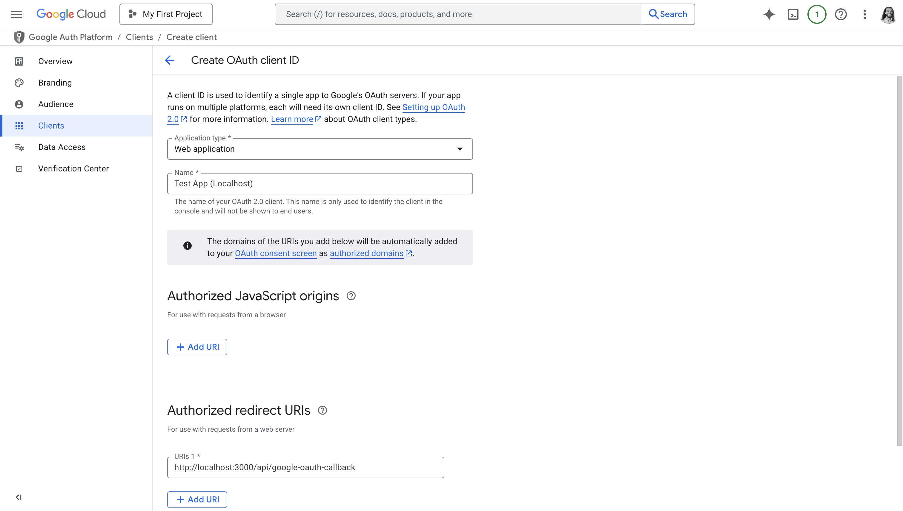
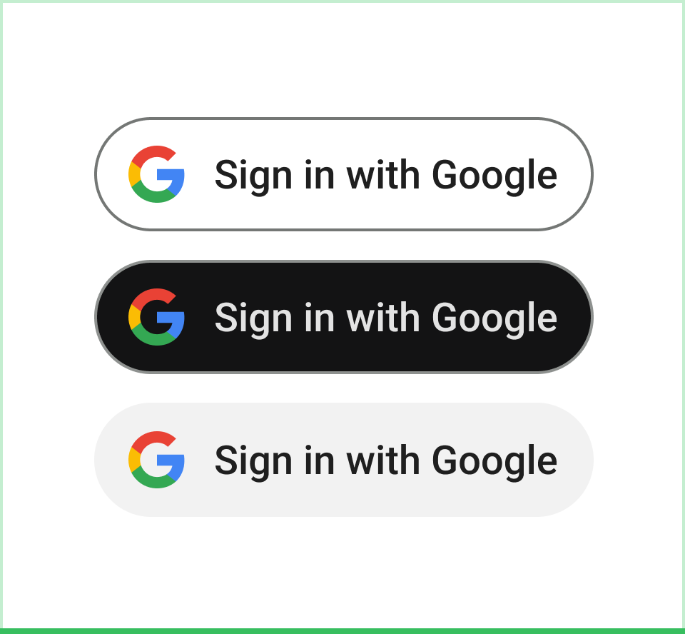

## A Real-World Google OAuth flow, Step by Step

Let's make this less abstract. Let's see exactly how Log in with Google works
from the outside, using Chess.com as an example.

<Steps>

<Step>

### Redirect to Google

<Frame caption="Let's see exactly what happens when you click Log in with Google on Chess.com">
  
</Frame>

I click on the "Log in with Google" button on Chess.com. Chess.com redirects me
to this URL:

```
https://accounts.google.com/o/oauth2/v2/auth?response_type=code&access_type=online&client_id=407636599248-65fjsu5h2o11er1bfjnb9ultft2246n9.apps.googleusercontent.com&redirect_uri=https%3A%2F%2Fwww.chess.com%2Flogin%2Fgoogle%2Fredirect&state=d332ddf2c2bfd392ae049dd.duEg7Q33Iq5JfbCTZbRuFEuVbCIulN9fE8GWFh2FciM.RJtYq3iaD8gWKMDCAPseIjHPCxAZ375ySZfRISTDCmUyt3eMa7lG6BoL2w&scope=https%3A%2F%2Fwww.googleapis.com%2Fauth%2Fuserinfo.email%20https%3A%2F%2Fwww.googleapis.com%2Fauth%2Fuserinfo.profile&prompt=select_account
```

We'll examine every element of this URL later, but the short answer is:

* `https://accounts.google.com/o/oauth2/v2/auth` is the Google [Authorization Endpoint](#authorization-endpoint).

* `response_type=code` indicates that we're doing the "Authorization Code" flow.

  The only other possible value is `response_type=token`, which is for the
  "Implicit" flow. It's very rare to see the implicit flow used in larger
  applications, because it's less secure and Google puts a bunch of limitations on
  the flow.

* `access_type=online` indicates that Chess.com is not doing any [background
  activity](#background-activity-with-refresh-tokens). They could have left this
  parameter out, because `online` is the default.

* `client_id=407636599248-65fjsu5h2o11er1bfjnb9ultft2246n9.apps.googleusercontent.com`
  tells Google which application this flow is for. The value of the `client_id`
  parameter is called an "OAuth Client ID".

  `407636599248-65fjsu5h2o11er1bfjnb9ultft2246n9.apps.googleusercontent.com` is
  Chess.com's OAuth Client ID.

* `redirect_uri=https%3A%2F%2Fwww.chess.com%2Flogin%2Fgoogle%2Fredirect` tells
  Google where Chess.com would like me to be redirected back to. In this case,
  it's (after URL-decoding) `https://www.chess.com/login/google/redirect`.

* `state=d332[...]oL2w` is a parameter that Google will return back to Chess.com
  as part of the redirect to `https://www.chess.com/login/google/redirect`.
  
  Under the hood, Chess.com uses this to protect themselves against [cross-site
  request forgery (CSRF)
  attacks](#session-fixation-using-cross-site-request-forgery-csrf).

* `scope=https%3A%2F%2Fwww.googleapis.com%2Fauth%2Fuserinfo.email%20https%3A%2F%2Fwww.googleapis.com%2Fauth%2Fuserinfo.profile`
  tells Google what Chess.com wants to know about me. After URL-decoding and
  splitting on space, it's these values:

    * `https://www.googleapis.com/auth/userinfo.email`
    * `https://www.googleapis.com/auth/userinfo.profile`

  These strings happen to be URL-shaped, but they are essentially codenames. They
  indicate that Chess.com wants to know my email and my personal information
  details (such as my name and profile picture).

* `prompt=select_account` tells Google to always ask which Google account I want
  to log in to Chess.com with. Otherwise, if I had logged in to Chess.com
  previously, Google would re-use my last account selection automatically.

</Step>

<Step>

### Google consent

In the previous step, Chess.com redirected me to `accounts.google.com` in order
to kick off a "Log in with Google". Now, it's Google's turn to decide what
happens next. Google has my user information, and they want to make sure I'm OK
with them giving that information out to Chess.com.

From Chess.com's redirect, Google knows that:

1. This request is a "Log in with Google" request for an OAuth Client whose ID is
   `407636599248-65fjsu5h2o11er1bfjnb9ultft2246n9.apps.googleusercontent.com`.
2. That client wants to know my email and profile details.

What Google does next is it looks up the OAuth Client ID in its database, and
can see that it corresponds to Chess.com. That's how Google knows to show
"Chess.com" on the consent screen.

As part of this process, Google also makes sure that the `redirect_uri` of
`https://www.chess.com/login/google/redirect` is indeed one Chess.com has
previously told Google they'd use. Google also checks that the `scope` requested
is OK with their [sensitive scope](#sensitive-scope-verification) policy.

At this point, I give Google my consent, and Google redirects back to Chess.com.

</Step>

<Step>

### Google redirects back

Google redirects my web browser back to Chess.com with the following URL:

```
https://www.chess.com/login/google/redirect?state=d332ddf2c2bfd392ae049dd.duEg7Q33Iq5JfbCTZbRuFEuVbCIulN9fE8GWFh2FciM.RJtYq3iaD8gWKMDCAPseIjHPCxAZ375ySZfRISTDCmUyt3eMa7lG6BoL2w&code=4%2F0Ab_5qlm-iy_if2PZE-a1eVQG2f6Px71YlcIm85oTurYIxoQBnbPT8iKcN70uK0qIAyCZJq&scope=email+profile+openid+https%3A%2F%2Fwww.googleapis.com%2Fauth%2Fuserinfo.profile+https%3A%2F%2Fwww.googleapis.com%2Fauth%2Fuserinfo.email&authuser=0&prompt=consent
```

<Error>

Never give out an OAuth `code` parameter to others. You must keep `code` secret.

The `code` in this example has been modified. It's shaped like a real `code`
would be, but its value is fake and randomized.

</Error>

The elements of this redirect are:

* `https://www.chess.com/login/google/redirect` is the `redirect_uri` that
  Chess.com provided as part of its [redirect to Google](#redirect-to-google).

* `state=d332[...]oL2w` is the same `state` that Chess.com provided in that
  redirect.

* `code=4%2F0[...]CZJq` is called an Authorization Code. This value is
  sensitive. URL-decoded, this one is:

  ```
  4/0Ab_5qlm-iy_if2PZE-a1eVQG2f6Px71YlcIm85oTurYIxoQBnbPT8iKcN70uK0qIAyCZJq
  ```

There are additional parameters that Google returns, but applications can always
ignore them.

</Step>

<Step>

### Exchange the Authorization Code

At this point, we can't see what Chess.com does, because the next step happens
from backend code on Chess.com's servers. But we can infer some details, because
Log in with Google works the same for every server.

Chess.com's servers sends an HTTP POST request to
`https://oauth2.googleapis.com/token` with the following parameters:

* `code=4%2F0[...]CZJq` is the Authorization Code from Google's redirect back to
  Chess.com.

* `client_id=407636599248-65fjsu5h2o11er1bfjnb9ultft2246n9.apps.googleusercontent.com`,
  the same client ID Chess.com used to redirect to Google.

* `client_secret=...` is a parameter that only Chess.com knows. Chess.com got
  this value from Google when they [registered their Google OAuth
  Client](#registering-a-google-oauth-client).

* `redirect_uri=https%3A%2F%2Fwww.chess.com%2Flogin%2Fgoogle%2Fredirect` is the
  same `redirect_uri` Chess.com used to redirect to Google.

* `grant_type=authorization_code` indicates that we're not doing [background
  activity](#background-activity-with-refresh-tokens).

Google responds to this request with something like this:

```json
{
  "access_token": "1/fFAGRNJru1FTz70BzhT3Zg",
  "expires_in": 3920,
  "token_type": "Bearer",
  "scope": "https://www.googleapis.com/auth/userinfo.email https://www.googleapis.com/auth/userinfo.profile"
}
```

<Error>

Never give out an OAuth `access_token` parameter to others. You must keep
`access_token` secret.

The `access_token` in this example is taken from Google's documentation, and
isn't valid.

</Error>

Chess.com's server then takes that `access_token`, and makes a `GET` request to
a "userinfo" endpoint run by Google:

```
https://www.googleapis.com/oauth2/v3/userinfo?access_token=1%2FfFAGRNJru1FTz70BzhT3Zg
```

Which returns a JSON object like:

```json
{
  "sub": "...",
  "name": "Ulysse Carion",
  "given_name": "Ulysse",
  "family_name": "Carion",
  "picture": "https://...",
  "email": "ulyssecarion@gmail.com",
  "email_verified": true,
  "locale": "en"
}
```

Chess.com now has my user details. They can now log me in as
`ulyssecarion@gmail.com`. They can update my profile picture and display name
from the `picture` and `name` fields.

</Step>

</Steps>

In short, the steps in doing Log in with Google from Chess.com are:

* Redirecting from Chess.com to Google. The technical term for this is a
  redirect to the [Authorization Endpoint](#authorization-endpoint).

* Google carries out a [consent flow](#google-consent-flow).

* Google sends the user back to Chess.com. The technical term for the
  Chess.com-side redirect URL is the [Redirection
  Endpoint](#redirection-endpoint).

* Chess.com talks to Google's [Token Endpoint](#token-endpoint) to acquire an
  access token.

* Chess.com [uses the access token](#accessing-google-apis) to get details about
  the user.

* Chess.com logs me in, and lets me [resume using their
  application](#resuming-user-activity).

Each of those steps are covered in greater detail in ["Elements of a Google
OAuth Flow"](#elements-of-a-google-oauth-flow). But to carry out these steps,
we'll first cover [registering a Google OAuth
Client](#registering-a-google-oauth-client), so that we can see the entire
picture.

## Elements of a Google OAuth flow

### Registering a Google OAuth Client

In later steps, you're going to need a Google OAuth Client ID and Secret. You
get these from Google by creating a Google OAuth Client.

<Steps>

<Step>

#### Go to Google Cloud Console Credentials

<Frame caption="Google Cloud Console Credentials page">
  
</Frame>

Visit the [Credentials](https://console.cloud.google.com/apis/credentials)
section of the Google Cloud Console.

<Note>

Take note of what account you're currently logged into in Google Cloud Console.
If you have work and personal Google accounts, make sure you're not logged into
the wrong one!

Even your personal Google account can use the Google Cloud Console, and you
can't transfer your OAuth configuration between accounts.

</Note>

Google Cloud is Google's competitor to Amazon Web Services and Microsoft Azure,
but you don't need to use any of Google's cloud services to use Log in with
Google.

Click on the "Create Credentials" button. From the dropdown, choose "OAuth
client ID".

</Step>

<Step>

#### Configure your OAuth Consent Screen

If Google tells you to configure your consent screen, click on the "Configure
Consent Screen" button, or follow [this
link](https://console.cloud.google.com/auth/branding) to your project's Google
Auth Platform Branding settings.

If a "Get started" button is present, click on it. Follow the questions Google
asks. A few points to note:

1. Your **App Name** is public-facing. This is not an internal codename.
2. When choosing your **Audience**, choose **External**.
3. Make sure to provide an accurate **Contact Information**, especially if you may later plan to use [Sensitive and Restricted scopes](#sensitive-and-restricted-scope-verification).

Once you're done, go back to
[Credentials](https://console.cloud.google.com/apis/credentials) again, and
click on "Create Credentials" and "OAuth client ID" again.

</Step>

<Step>

#### Configure your OAuth Client

<Frame caption="Creating an OAuth Client">
  
</Frame>

Choose "Web Application" as the "Application type".

You can ignore **Authorized JavaScript origins**. Under **Authorized redirect
URIs**, click "Add URI" and input a URL that you control that Google will
redirect your users to. 

You'll be adding code to handle redirects to this endpoint in [a later
section](#redirection-endpoint). If you're developing your app, you can put a
`localhost` URL here. You can create a separate OAuth Client for production
later.

Click "Create". Google says it may take "a few hours" to take effect; in
practice it's almost always instantaneous.

#### Copy your OAuth Client ID and secret

After clicking "Create", Google shows you your new OAuth Client's ID and Secret.

If you accidentally close this modal, or need to come back to it later, you can
see this information again by going to the
[Credentials](https://console.cloud.google.com/apis/credentials), and clicking
on your client under "OAuth 2.0 Client IDs".

Your Google OAuth Client ID typically ends in `apps.googleusercontent.com`. It
is public and not sensitive; you can give this value out to anyone.

Your Google OAuth Client secret typically starts in `GOCSPX`. This value is a
secret. Do not give it out. Google shows it to you in plaintext, but it is still
a secret.

</Step>

</Steps>

### Authorization Endpoint

To start your Log in with Google process, you need to redirect your users to a
URL called the "Authorization Endpoint". This is an endpoint Google hosts, and
your application needs to redirect to the Authorization Endpoint when your users
click on "Log in with Google".

#### Styling the "Log in with Google" Button

Google is particular about how your "Log in with Google" button looks. If you
ever need to use [sensitive or restricted
scopes](#sensitive-and-restricted-scope-verification), Google will deny you
access to their APIs if this button isn't styled correctly.

Google lays out their requirements in their [branding
guidelines](https://developers.google.com/identity/branding-guidelines). The
most common mistake folks make is to make Google's logo monochrome.

<Frame caption="Images taken from the Google Branding Guidelines. Your button must look like one of the options on the left. The options on the right are not acceptable to Google.">
  
  
</Frame>

#### The `state` Parameter

To protect yourself from [session fixation
attacks](#session-fixation-using-cross-site-request-forgery-csrf), you need to
generate a "CSRF token", which you'll include as the `state` parameter in the
next step.

A UUIDv4 is a good choice of CSRF token. You should:

1. Generate a UUIDv4 client-side, using [`crypto.randomUUID`](https://developer.mozilla.org/en-US/docs/Web/API/Crypto/randomUUID)
2. Put that UUIDv4 in [local storage](https://developer.mozilla.org/en-US/docs/Web/API/Window/localStorage). `google_csrf_token` is a good choice of key name.

In other words, do this:

```javascript
const state = crypto.randomUUID();
localStorage.setItem("google_csrf_token", state);
```

In the next section, you'll redirect to a `accounts.google.com` URL. That URL
needs a `state` parameter. You'll use this UUIDv4 as your `state` after you've
stored it to local storage.

#### Authorization Endpoint Parameters

When your user clicks on your "Log in with Google", you'll now redirect them to
the Google Authorization Endpoint.

The Authorization Endpoint takes [a lot of optional
parameters](https://developers.google.com/identity/protocols/oauth2/web-server#creatingclient),
but a good starting point is this:

```
https://accounts.google.com/o/oauth2/v2/auth?state=STATE&client_id=YOUR_OAUTH_CLIENT_ID&redirect_uri=YOUR_REDIRECT_URL&scope=profile%20email&response_type=code&prompt=select_account
```

With these replacements:

* Replace `STATE` with your [`state` from the previous step](#the-state-parameter).

* Replace `YOUR_OAUTH_CLIENT_ID` with your [OAuth Client
ID](#copy-your-oauth-client-id-and-secret). 

* Replace `YOUR_REDIRECT_URL` with
what you configured for your [OAuth Client](#configure-your-oauth-client). Make
sure to URL-escape slashes into `%2F`.

If you have no interest in using Google APIs (beyond just supporting Log in with
Google), then you don't need any further parameters. The parameters here are:

| Authorization Endpoint Query Parameter | Purpose                                                                                                                                                                                                        |
|----------------------------------------|----------------------------------------------------------------------------------------------------------------------------------------------------------------------------------------------------------------|
| `client_id`                            | Required. Your Google OAuth Client ID.                                                                                                                                                                         |
| `redirect_uri`                         | Required. The Redirect URL you configured for your Google OAuth Client.                                                                                                                                        |
| `scope`                                | Required. Indicates what details about a user you want, as well as what Google APIs you use on their behalf. `profile email` gives you the essentials of [Google's User Data Model](#googles-user-data-model). | 
| `response_type`                        | Required. Use `code`. Other values are for alternative OAuth flows that aren't as common.                                                                                                                      |
| `prompt`                               | Optional, Google-specific. Use `select_account`, so that your existing users can easily switch between work and personal Google accounts.                                                                      |

If you do intend to use Google's API beyond just supporting a login flow, see
["Using other Google APIs"](#using-other-google-apis). In particular, expect to
use a different value for the `scope` parameter.

### Google Consent Flow

After you redirect to the Google Authorization Endpoint, Google will show your
user a consent screen.

### Redirection Endpoint

After your user goes through the Google consent flow, Google will redirect your
user's web browser to the `redirect_uri` you provided the [Authorization
Endpoint](#authorization-endpoint).

From your code's perspective, users will arrive on your `redirect_uri` with
these query parameters in their request:

| Redirection Endpoint Query Parameter | Purpose                                                                                         |
|--------------------------------------|-------------------------------------------------------------------------------------------------|
| `state`                              | Authenticate this to protect against CSRF attacks.                                              |
| `code`                               | A Google Authentication Code. After validating `state`, use this to get details about the user. |

You need to authenticate that `state` is what you expect. Otherwise, you are
vulnerable to [CSRF-based session
fixation](#session-fixation-using-cross-site-request-forgery-csrf) attacks.

If this is a legitimate redirect from Google, then the `state` parameter you
receive here is equal to [the `state` you saved
previously](#the-state-parameter). Check that it is, by running code along the
lines of:

```javascript
if (localStorage.getItem("google_csrf_token") !== new URL(window.location).searchParams.get("code")) {
    throw new Error("invalid csrf token");
}

localStorage.removeItem("google_csrf_token");
```

If the `state` is valid, you can proceed to the next step.

### Token Endpoint

Create a new endpoint that clientside JavaScript on your Redirection Endpoint
can call. Have this new endpoint, e.g. `POST /api/exchange-google-code`, take a
`code` parameter. Have your clientside code call this new endpoint with the
`code` query parameter from Google.

You will now call Google's Token Endpoint to exchange `code` (the "Authorization
Code") for an `access_token` (an "Access Token").

#### Token Endpoint Parameters

The [Token
Endpoint](https://developers.google.com/identity/protocols/oauth2/web-server#exchange-authorization-code)
is an endpoint that Google hosts at `https://oauth2.googleapis.com/token`.

You need to call this parameter with five parameters. They are all required.

| Token Endpoint Body Parameter | Purpose                                                                              |
|-------------------------------|--------------------------------------------------------------------------------------|
| `grant_type`                  | Always `authorization_code`.                                                         |
| `code`                        | The Authorization Code you got at the [Redirection Endpoint](#redirection-endpoint). |
| `client_id`                   | The same `client_id` you used previously.                                            |
| `client_secret`               | Your Google [OAuth Client Secret](#copy-your-oauth-client-id-and-secret).            |
| `redirect_uri`                | The same `redirect_uri` you used previously.                                         |

These parameters must be sent as a form body, *not* as JSON. The correct
`Content-Type` of your request is `application/x-www-form-urlencoded`. HTTP form
body is the same format as URL query parameters, except without the leading `?`.
Most languages have built-in support for this data format.

For example, with JavaScript `fetch`, you would call this endpoint by using the
built-in [`FormData`](https://developer.mozilla.org/en-US/docs/Web/API/FormData)
API:

```javascript
const body = new FormData();
body.set("grant_type", "authorization_code");
body.set("code", "...");
body.set("client_id", "...apps.googleusercontent.com")
body.set("client_secret", "GPCSPX-...")
body.set("redirect_uri", "...");

const tokenResponse = await fetch("https://oauth2.googleapis.com/token", {
  method: "POST",
  body,
});
```

#### Token Endpoint Response

If Google responds with anything other than a 200, do not log the user in. The
two most common problems are:

1. If you get back an object with `error` set to `invalid_client`, then your
   `client_id`/`client_secret` parameters are incorrect.

2. If you get back an object with `error` set to `invalid_grant`, then make sure
   you're not trying to redeem the same `code` twice. This happens a lot with
   `React.StrictMode` or when manually debugging.

   Authorization Codes are one-time-use only. Once you redeem one, you have to hit
   the [Authorization Endpoint](#authorization-endpoint) again to get a new code to
   test with.

In the happy path, Google's Token Endpoint will return a JSON object with a few
properties. The only one that matters for Log in with Google is `access_token`,
which usually has a value that starts with `ya29...`. The other parameters are
mostly useful only if you want to [use other Google
APIs](#using-other-google-apis), in particular if you want to do [background
activity](#background-activity-with-refresh-tokens).

### Accessing Google APIs

In the previous section, you exchanged `code` for `access_token`. Now, you'll
exchange `access_token` for [user details](#googles-user-data-model).

From Google's perspective, `access_token` is a general-purpose API token for
calling any Google API. But for Log in with Google, the only endpoint you need
to call is the "userinfo" endpoint.

Your backend, from the same endpoint that you used in the previous section, now
sends a GET request to `https://openidconnect.googleapis.com/v1/userinfo` with
the `access_token` from the previous section as an `Authorization: Bearer`
token. 

For example, in JavaScript:

```javascript
// we got tokenResponse in the previous section
const accessToken = await tokenResponse.json()["access_token"];
const userinfoResponse = await fetch("https://openidconnect.googleapis.com/v1/userinfo", {
  headers: {
    "Authorization": `Bearer ${accessToken}`,
  }
});
```

This returns a JSON object representing a user according to [Google's User Data
Model](#googles-user-data-model). You now have the user's Google ID, email,
profile picture, and display name -- it's up to you to create a session for your
user, and return that session data to your clientside caller.

## Google's User Data Model

Google's user lifecycle is a frequent source of bugs for implementers of Log in
with Google. Google's `sub` property is a primary ID; `email` is not.

Google's [`userinfo` endpoint](#accessing-google-apis) returns the following
properties on a user:

| Property                              | Notes                                                                                                           | Changes over time?                           |
|---------------------------------------|-----------------------------------------------------------------------------------------------------------------|----------------------------------------------|
| `email`                               | The user's current primary email.                                                                               | Yes -- users can update their email address. |
| `sub`                                 | Short for "subject". A unique, unchanging identifier for the user.                                              | No. Google guarantees `sub` to be constant.  |
| `hd`                                  | Short for "hosted domain". The Google Workspace this user belongs to, identified by its current primary domain. | Yes -- companies can change primary domain.  |
| `name` / `family_name` / `given_name` | The user's full name, last name, and first name.                                                                | Yes -- users can change their name.          |

When handling Google logins, you need to get or create a user based on their
Google details. The correct way to tie a Google user to your user is to store
their Google `sub` on your application's user data model.

Google is very explicit that you should not use `email` instead of `sub` to do
this. Users can change their email address in Google -- Google does not want
users to be locked out of your product when that happens.

If your product is B2B, you have a concept of an
[organization](/docs/features/b2b-multitenancy). It's common to automatically
put all Google users from the same Google Workspace into the same organization.
A user's `hd` is a reliable way to determine that a user belongs to a Google
Workspace, as well as which Google Workspace it is.

The `hd` claim may change over time. When a company changes its primary domain,
the `hd` claim changes with it. Google does not have a good alternative to `hd`
that remains fixed across changes to primary domains.

To handle these cases, you must at minimum support updating organizations'
associated `hd` value. Be prepared to have to do so "from the backend", as your
customers will likely be locked out of their old-`hd` organization. Consider
supporting a list of `hd` values associated with each organization, so that
customers can safely roll back to their previous `hd` value if they cancel their
change of primary domain.

## Using other Google APIs

Log in with Google is, from Google's perspective, the simplest possible way of
using Google's ecosystem of APIs. If you want to access your user's Google data
-- such as their Calendar, Gmail, Drive, etc. -- you implement a flow very
similar to Log in with Google above, but with one modification:

When redirecting to the [Authorization Endpoint](#authorization-endpoint) you'll
change the `scope` parameter. Instead of `profile email`, you'll ask for one of
the values listed in [OAuth 2.0 Scopes for Google
APIs](https://developers.google.com/identity/protocols/oauth2/scopes).

When requesting these additional scopes from Google, use [Incremental
Authorization](#incremental-authorization) to avoid asking for invasive Google
permissions right from the signup flow.

If you're planning on doing [background
activity](#background-activity-with-refresh-tokens), you'll also pass an
additional `&access_type=offline` parameter to the Authorization Endpoint.

### Incremental Authorization

If you want to access your user's Google resources, you need to ask for the
relevant OAuth scopes. Google supports ["incremental
authorization"](https://developers.google.com/identity/protocols/oauth2/web-server#incrementalAuth),
meaning you can initially request minimal permissions, and then ask for more
permissions later without losing the old permissions.

<Frame caption="Incremental authorization in [Notion](https://notion.com). They already can access some of my data, and now they additionally want to access my Google Calendar.">
  
</Frame>

For example, if your product has functionality that requires connecting to a
user's Gmail account, that doesn't mean you need to ask for Gmail access as part
of the "Log in with Google" flow. You can ask for the minimal `openid email
profile` permissions on login, and then ask for the much more intrusive
`https://www.googleapis.com/auth/gmail.send` permission after the user clicks on
a "Configure Gmail integration" button in your product.

To use incremental authorization, go through the [Google OAuth
flow](#elements-of-a-google-oauth-flow) as usual, with only one change: when
redirecting to the [Authorization Endpoint](#authorization-endpoint), include
your additional permission as the `&scope=` parameter, and include two new query parameters:

* `&prompt=consent` (instead of `&prompt=switch_account`, which is only for Log
  in with Google)
* `&include_granted_scopes=true`

```txt {6-9} An Example Incremental Authorization URL
https://accounts.google.com/o/oauth2/v2/auth
    ?client_id=...
    &response_type=code
    &state=...
    &redirect_uri=...
    &prompt=consent
    &include_granted_scopes=true
    &scope=https%3A%2F%2Fwww.googleapis.com%2Fauth%2Fgmail.send
```

Incremental authorization does not log your user out. You will receive a new
`access_token` (and [`refresh_token`](#background-activity-with-refresh-tokens),
if you asked for one). Your user will only be asked to review the additional
permission you're asking for.

You can use a different `redirect_uri` for your incremental authorization as you
do for your main "Log in with Google" flow. To do this:

1. Find your OAuth Client under the
   [Credentials](https://console.cloud.google.com/apis/credentials) section of
   the Google Cloud Console. You can have multiple URLs under "Authorized
   redirect URIs"; add your incremental authorization redirection endpoint here.

2. In your redirect to `https://accounts.google.com/o/oauth2/v2/auth`, use this
   new URL as your `redirect_uri`.

When calling the [Token Endpoint](#token-endpoint), use the same `redirect_uri`
you used when redirecting to the Authorization Endpoint.

### Background Activity with Refresh Tokens

When you call the [Token Endpoint](#token-endpoint), you get back an
`access_token`. This access token will only be valid for one hour. If you need
longer-lived access, you need a `refresh_token`.

A refresh token does not expire. You can, at any point, exchange a refresh token
for a new access token. You can then use that access token to access Google APIs
on behalf of your user.

#### Acquiring a Refresh Token

To acquire a refresh token, you should do this as part of an [incremental
authorization](#incremental-authorization). 

When redirecting to the Google [Authorization
Endpoint](#authorization-endpoint), you'll tell Google you want a
`refresh_token` by passing a `&access_type=offline` query parameter in the
redirect:

```txt {9} An Example Incremental Authorization URL
https://accounts.google.com/o/oauth2/v2/auth
    ?client_id=...
    &response_type=code
    &state=...
    &redirect_uri=...
    &prompt=consent
    &include_granted_scopes=true
    &scope=https%3A%2F%2Fwww.googleapis.com%2Fauth%2Fgmail.send
    &access_type=offline
```

Then, when you call the [Token Endpoint](#token-endpoint), you'll get back a
JSON object with a new `refresh_token` property:

```json {4} A Token Endpoint Response with refresh_token
{
  "access_token": "ya29...",
  // ...
  "refresh_token": "1//...",
  // ...
}
```

That `refresh_token` value is your refresh token. Refresh tokens are sensitive
secrets; never give out refresh tokens to others.

#### Exchanging `refresh_token` for a new `access_token`

You can't call Google APIs using a `refresh_token`. Refresh tokens have only one
purpose, which is to get new (short-lived) access tokens.

You can exchange `refresh_token` for an access token by calling the [Token
Endpoint](#token-endpoint), but with a very different set of parameters from
before. Those parameters are:

| Token Endpoint Body Parameter | Purpose                                                |
|-------------------------------|--------------------------------------------------------|
| `grant_type`                  | Always the exact string `refresh_token`.               |
| `refresh_token`               | Your refresh token. This usually starts with `1//...`. |
| `client_id`                   | The same `client_id` you used previously.              |
| `client_secret`               | The same `client_secret` you used previously.          |

As before, these parameters most be form-encoded parameters in the HTTP body of
a POST to `https://oauth2.googleapis.com/token`. See the ["Token Endpoint
Parameters"](#token-endpoint-parameters) section of this article for more
details on how make such an HTTP request from your backend.

The response from this endpoint is roughly the same as before. In particular, it
always contains an `access_token` JSON property. That access token is your
"refreshed" access token, which you'll use to call Google APIs on behalf of your
user.

#### Cadence of refreshing access tokens

Google doesn't recommend any specific strategy for when you exchange refresh
tokens for access tokens. However, here are a few considerations:

1. Refresh tokens and access tokens are specific to a user. Whatever your
   product does in background, it has to do it on a per-Google-user basis.

2. Access tokens last 5 minutes (3600 seconds). If your background activity
   sometimes takes longer than 5 minutes, you need to be prepared to have to
   refresh your access token in the middle of that activity.

3. Refresh tokens don't expire. You are supposed to save them to your database.

4. Exchanging refresh tokens for access tokens doesn't expire your old access
   tokens.

A reasonable starting point for a "refresh token strategy" would be to:

1. Make a module (class, struct, whatever's standard in your codebase) inside
   your backend code that knows how to use your database to get a refresh token
   given a user in your product.

2. That module gives has a function that returns an access token. That function
   caches results for up to 5 minutes. If there's no cached result, or the cache is
   older than 5 minutes old, it exchanges the refresh token for a new access token.

3. Whenever you have code that wants to do background work, it uses that module
   to always have an access token available. You don't need to worry about having
   multiple instances of this module in flight at once.

If you're not sure where to begin, this approach is a reasonable starting point.
If it turns out this approach doesn't meet your requirements, you can adapt your
solution.

### Sensitive and Restricted Scope Verification

<Warning>

Google's Sensitive and Restricted Scope Verification process is a common source
of delay for new products that interact with Gmail, Google Calendar, Google
Drive, and other Google services.

Restricted Scope Verification takes **at least a month, sometimes multiple
months**. 

Sensitive Scope Verification takes **about a week**.

</Warning>

Google categorizes all of its OAuth scopes into three buckets:

* **Non-sensitive scopes** are the least risky APIs. Basic scopes like `openid`,
  `email`, or `profile` are non-sensitive scopes.

  If "Log in with Google" is the only reason you use Google OAuth, then all the
  scopes you need are non-sensitive, and you do not need worry about Google's
  verification process.

* **Sensitive scopes** are APIs that Google considers risky. Read-only
  access to Google Calendar is a sensitive scope. 
  
* **Restricted scopes** are the APIs that Google considers the most risky. Read
  access to Gmail is a restricted scope.

#### Determining if a scope is sensitive or restricted

Go to the [Data Access](https://console.cloud.google.com/auth/scopes) section of
Google Auth Platform. This is where you can declare to Google the set of OAuth
scopes you intend to request access to.

Click on the "Add or remove scopes" button in the Data Access settings. From the
sidebar, use the search input to find the scope you'd like to access.

If the API you want to access isn't listed, it may be that you haven't enabled
that API yet in your Google Cloud project. Google requires you opt into every
API you use, and you do that opt-in from the [API
Library](https://console.cloud.google.com/apis/library).

<Frame caption="The Google API Library. Use this to opt into Google APIs.">
  
</Frame>

After enabling APIs and adding the scopes you want to your Data Access settings,
Google will categorize your requested scopes into the sensitivity bucket they
fall into.

<Frame caption="An example set of scopes. `calendar.readonly` is sensitive, and `gmail.compose` is restricted.">
  
</Frame>

#### Exceptions to Scope Verification

If you intend to use sensitive or restricted scopes with the general public, you
won't be able to circumvent verification. Google makes exceptions for three
kinds of use-cases, which are spiritually for "pre-production" and "internal to my
company" use-cases:

1. If your app's ["Publishing
   status"](https://support.google.com/cloud/answer/15549945?sjid=6288128283645584599-NC#publishing-status&zippy=%2Ctesting)
   is **Testing**, then you don't need scope verification. You can configure
   your app's publishing status under the
   [Audience](https://console.cloud.google.com/auth/audience) section of Google
   Auth Platform.

   If you have multiple OAuth Clients in your Google project, publishing status
   affects all of them.

   There are serious restrictions on "Testing" apps. In particular, you need to
   whitelist each user that can use your app. You can only whitelist up to 100
   users.

2. If your app's ["User
   type"](https://support.google.com/cloud/answer/15549945?sjid=6288128283645584599-NC#user-type)
   is **Internal**, then you don't need scope verification.

   If your Google account belongs to a Google Workspace, then your "Internal" apps
   can only be used by other members of your Google Workspace -- in other words,
   your coworkers.

#### Sensitive Scope Verification Process

If you use a scope marked as "Sensitive", Google will require [Sensitive Scope
Verification](https://developers.google.com/identity/protocols/oauth2/production-readiness/sensitive-scope-verification)
before letting you go to production.

This process usually takes a week if you've done everything right.. Consult
Google's documentation to ensure you're following best practices. In particular,
be sure to:

1. Use [correct branding](#styling-the-log-in-with-google-button) for your Log
   in with Google button.

2. Use [incremental authorization](#incremental-authorization) to avoid asking
   for sensitive scopes without first explaining why you need them.

You'll need to upload a YouTube video demonstrating your app's login flow and
subsequent incremental authorization request. That video will play a large part
in determining whether this process goes smoothly for you.

Sensitive scope verification is not an automated process. When you submit a
request, you become a support case inside of Google's systems. A human that
works for Google will review your case. Be kind to this human.

Ultimately, Google's goal with sensitive scope verification is to make sure you
aren't distributing malware. Google is trying to protect their users.

#### Restricted Scope Verification Process

If you use a scope marked as "Restricted", Google will require [Restricted Scope
Verification](https://developers.google.com/identity/protocols/oauth2/production-readiness/restricted-scope-verification)
before letting you go to Production.

This process usually takes at least a month if you've done everything right.
You'll have to follow all the steps of the [Sensitive Scope Verification
Process](#sensitive-scope-verification-process), plus a security assessment.
You'll need to pass this security assessment once, and then repeat the process
every 12 months indefinitely.

Take the security assessment seriously. Pay very close attention to every
detail. At a high level, the process will go like this:

1. After submitting your request to Google for Restricted Scope Verification,
   you'll receive correspondence from Google.

2. In that correspondence, Google will assign you to fulfill a "CASA
   Assessment". [CASA](https://appdefensealliance.dev/casa) is a standardized set
   of security checklists that Google has outside contractors verify against your
   application.

   <Tip>

   The CASA website is confusing, because it's part of the "App Defense Alliance",
   which does a bunch of unrelated things. You can ignore "Malware Mitigation",
   "MASA", or other programs under the App Defense Alliance. Only CASA applies to
   you.
 
   Whenever the CASA documentation says "the application", that means your product.
   Whenever the CASA documentation says "framework user", that means "Google". 
    
   </Tip>

3. Google will tell you what [CASA Assurance
   Tier](https://appdefensealliance.dev/casa/casa-tiering) you need to fulfill.

4. Google has a bunch of [Authorized
   Assessors](https://appdefensealliance.dev/casa/casa-assessors) that are allowed
   to certify that you pass the CASA security checklist. You will pay one of these
   Authorized Assessors to validate that you pass CASA requirements.

5. Exactly what happens next depends on which Authorized Assessor you choose.
   Generally speaking, the process starts with the Assessor doing a set of
   automated and non-automated tests against your application.

   If your Assessor finds issues, you'll need to fix them and then repeat the
   scanning process. It can take up to a week to go through this cycle.

6. Your Assessor will also ask you to complete a questionnaire. It will usually
   have dozens of questions, many of which will seem like trivial variations of
   one another.

   Answer these questions carefully. Each question is a checkbox your Assessor
   needs to verify you comply with. Whenever possible, make your compliance easy
   for your Assessor to check off.

The Restricted Scope Verification process is a process you need to approach with
care. If you stay on top of this process, you can expect it to take
approximately a month. The process can drag on for much longer if you aren't
proactive about quickly and carefully doing what the process requires of you.

## Limitations to Log in with Google

This section documents some issues you're going to encounter with "Log in with
Google" in the wild. This section is meant to illustrate challenges you should
anticipate, and which you can't avoid because of how Google's auth mechanisms
work.

### User and Tenant ID Stability

See the [Google User Data Model](#googles-user-data-model) section of this
article for more, but you should be aware that `email` and `hd` ("hosted
domain", i.e. a company identifier) can change over time for the same user /
company. Google has an alternative to email that is fixed over time, but Google
does not have such an alternative for identifying companies.

### Enterprises need you to disable Log in with Google

Log in with Google is a popular login method for many individuals and small
businesses. Large businesses, however, often do not like Log in with Google.

It is not easy for a large business to restrict which of their employees can use
Log in with Google to log into your product. Google does have [some
tools](https://support.google.com/a/answer/7281227) that Google Workspace
operators can use, but they are difficult to use.

Instead, large businesses will ask that you support turning off Log in with
Google for their company within your product. You should be prepared to do this.
Instead, your customer will likely want their logins happen exclusively through
[SAML](/docs/login-methods/primary-factors/log-in-with-enterprise-sso-saml).

The simplest option for disabling Log in with Google on a per-company basis is
to have a "blacklist" of domains; if someone tries to Log in with Google from
that list of domains, then you deny the login. This approach works less well if
the company doesn't have a simple set of email domains they use; contractors or
various subsidiaries, for instance, may make a blacklist over-broad or
impractical. But it's usually a good starting point.

## Common Attacks

This section details common vulnerabilities that folks introduce when
implementing Log in with Google.

### Session Fixation using Cross-Site Request Forgery (CSRF)

<Note>

The approach described in [Authorization Endpoint](#authorization-endpoint) in
this article prevents this attack. In particular, the UUIDv4 used as a [`state`
parameter](#the-state-parameter) prevents all CSRF, including session fixation
over CSRF.

</Note>

"Session fixation" means "an attacker can trick victims into logging into an
account the attacker created".

It might not be obvious why this is an issue. Usually we're worried about
attackers logging into victim's accounts, not victims logging into attacker's
accounts. Here's an explanation of the attack:

1. An attacker is trying to steal company secrets from a victim employee.

2. The attacker signs up for your product, and creates a user profile that looks
   a lot like the victim's. They use the same name, profile picture, etc. When
   you're logged into this attacker-created account, you'd have to pay a lot of
   attention to notice it's a fake duplicate of the original account.

3. The attacker does the Log in with Google flow, but they block their web
   browser from actually redirecting to your [Redirection
   Endpoint](#redirection-endpoint). They now have a URL containing an OAuth `code`
   that, if redeemed, gives you user details about the attacker's fake account.

4. The attacker tricks your victim user into visiting that link. The attacker
   has 10 minutes between creating the link and getting the victim to click on
   it, because Google OAuth `code` values expire after 10 minutes.

5. The victim visits the link. If you didn't implement CSRF protection using the
   `state` parameter, then your webpage sends the `code` to the backend, and
   logs the victim into the attacker-created account.

6. The victim thinks they're logged in as usual, and inputs sensitive company
   details into your product. Your attacker has the ability to see this sensitive
   company data, because they can log in this account too.

In other words, session fixation is a way for attacker to execute very
convincing phishing attacks.

The link the victim visits is a form of "request forgery". It's "forged" in the
sense that the "authentic" redirect was meant to be used by the attacker, not
the victim.

The way to prevent this attack is to have your web application validate that it
was the one to redirect to Google in the first place. That's what the
`google_csrf_token` in the [`state` parameter](#the-state-parameter) section
above does. Before redirecting to Google, you save a random value and give it
out to nobody except the user. Before accepting a `code` from Google, you make
sure Google echoes back the same random value back to you. Attackers can't guess
that random value, and so they can't trick your web application into accepting
"forged" requests.
